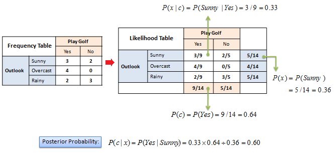
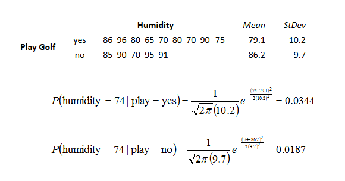

## Modeling 模型

Predictive Modeling 为输入值预测输出值。如果输出值是离散的（类别型的），则被称为 Classification Modeling；如果输出值是连续的（数值型的），则被称为 Regression Modeling

Descriptive Modeling 又叫做Clustering，则是将相似的数据分配到同一个聚类中

Association rules 则用来发现数据间的相关性

### Classifictaion 分类

分类任务，基于给定数据构建模型，来预测目标变量的类别

用来构建模型的数据集如上所示，可以将 Predictors 看成自变量X，Target看成因变量Y，X一般来说由若干个 predictor 构成，Y一般输出若干个状态

#### ZeroR

ZeroR 是最简单的分类方法，为target计算频率表，将其中频率最高的值作为模型的预测值，虽然该分类方法的预测能力很弱，但是可以用它来为别的分类方法提供一个性能测试的基线

因为predictors对预测模型没有任何贡献，所以ZeroR的预测能力是很差的，下图用Confusion Matrix展示了ZeroR的预测能力

#### OneR

OneR 是一个简单却精度较高的分类算法，产生的分类结果只 比最好的分类算法稍微差一点，与此同时OneR用来分类的规则却是极容易被人理解的

OneR 算法的伪代码如下：

	for predictor in predictors
		for v in predictor.values()
           
			Count how often each value of target (class) appears while the predictor's value is equal to v

			Find the most frequent class
           
			Make the rule assign that class to this value of the predictor
		
		end
    end

	# so far, each predictor has one rule, select the smallest total error on the whole training set
	Calculate the total error of the rules of each predictor, Choose the predictor with the smallest total error.

OneR 算法的大概思路是，为每个predictor计算一条规则，然后从所有predictor对应的规则中选取总误差最小的那个规则来作为数据集预测的规则；为predictor计算规则，其实就是为每个predictor value计算相应target value出现次数，然后将出现次数最高的target value作为predictor value对应的预测值，为该predictor的所有value计算好预测值后，该predictor的规则也就计算好了；从所有predictor对应的规则中选取总误差最小的，其实就是用规则对整个训练集进行精确度评估，然后选取精确度最高的那个规则来作为数据集的预测规则

数据集

为每个predictor计算的规则如下：

总误差最小的规则如下：

下图用Confusion Matrix展示了OneR的预测能力：

#### Naive Bayesian

朴素贝叶斯分类器，基于贝叶斯理论，假设各个predictor对target都有影响且影响是相互独立的，即条件独立的，朴素贝叶斯分类器的构建十分简单，对大数据集的处理很有帮助，同时其出色的分类效果完全不亚于很多复杂的分类器

简单来说，朴素贝叶斯分类器，就是基于条件独立的假设下，利用先验概率来估计后验概率，
如下图示：

其中，P(c)代表target value的先验概率，P(x)代表predictor value的先验概率，P(x|c)代表已知target value时出现predictor value的可能性，这些值都可以直接从训练集中计算获得，P(c|x)就是我们要计算的后验概率，x对应多个c，即predictor value对应若干target value，选取P(c|x)最大的那个target value作为相应precditor value的预测值，这就是分类的过程

计算过程如下图示：

首先为predictor计算频率表，再计算概率表，然后利用贝叶斯公式估算后验概率，将P(c|x)最大的那个target value作为predictor value的预测值

上面是针对一个predictor来估计target的，实际中往往有多个predictors来估计target，相应贝叶斯公式如下：

	P(C|X1X2X3...Xn) = P(X1X2X3...Xn|C)P(C)/P(X1X2X3...Xn)

假设各个predictor对target是互不影响的，则贝叶斯公式可以简化为：

	P(C|X1X2X3...Xn) = P(X1|C)P(X2|C)...P(Xn|C)P(C)/P(X1X2X3...Xn)

上式等号右边的P(Xi|C)以及P(X1X2...Xn)都可以通过训练集计算得到

值得注意的是，当训练集中某个predictor value对应某个target value出现次数为0时，即P(x|c)=0时，为了估算zero-frequency，将该predictor value对应的所有target value出现次数加一

朴素贝叶斯分类器同样可以应用到连续型变量中，不过在应用分类器之前需要将连续型变量binning处理，即按照区间进行分类。

此外还可以假设连续型变量符合某种分布规律，比如正态分布，如下图所示，湿度是一个连续变量，湿度跟是否打球的规律可以用正态分布来刻画：

#### Decision Tree

决策树模型可以解决离散型数据的分类问题和连续型数据的回归问题。构建决策树的过程，也是将数据集不断划分为子集的过程，预测新的数据时，沿着决策树根节点不断测试，直到到达叶节点后就为数据找到了类别标签。决策树中含有决策节点和叶节点，决策节点含有测试条件，根据测试结果决定后续进入哪个分支继续测试，叶节点含有类别标签。决策树有一个很大的优点，从根节点到叶节点的测试条件可以很容易的转换为if-else语句来表示。显然用决策树节点预测数据的类别标签很直观，只需要从根节点到叶节点访问决策树即可，但如何构建决策树呢？

下图展示了数据集对应的决策树模型：

在介绍构建决策树算法前先解释两个概念：熵和信息增量。

熵用来度量系统的不确定性大小，即熵值越小则不确定性越小，熵值越大则不确定性越大，当向系统中引入信息时，系统不确定性降低，也即熵减（也叫作信息增量）

假设系统中仅含有两类事件，下图展示了其中一个事件发生概率不同时，系统相应的熵值变化：

从上图可知，当系统中仅有其中一件事件发生时，系统熵值为0，也即系统不确定性为0，也可以说系统是同质的；当系统中两个事件发生概率相同时，系统不确定性最大。

决策树的构建过程如下：

1. 计算target的熵值

	

2. 为每个predictor计算，引入predictor信息后target的熵值，以及引入predictor后相应的信息增量，即熵减，也即引入predictor作为分割数据集的决策信息后，系统总体不确定性减少的量

	
	

3. 选取最大信息增量对应的predictor作为决策树根节点的测试条件，同时根据测试条件将数据集划分为若干部分（选取最大信息增量保证了数据子集尽可能趋于同质化），分别对应根节点各个分支，如果某个数据子集是完全同质的（即子集所有target值是相同的），则相应分支应该为叶节点，否则在相应分支上继续第二步来挑选没有选过且信息增量最大的predictor作为数据子集的划分，直到所有数据子集都是完全同质的，则决策树构建完成

#### Linear Discriminant Analysis

LDA线性判别分析，是一个简单鲁棒的分类方法。

QDA

PCA

#### Logistic Regression

#### K Nearest Neighbors

K近邻算法利用训练集中距离当前数据距离最近的K个数据样本，进行多数优先投票，即当前数据的标签跟K个最近邻居中的多数标签是一样的。

度量连续型数据样本间的距离公式：

度量离散型数据样本间的距离公式：

K的选取，K的值因数据集不同而不同，可以借助Cross Validation来检测K值是否

