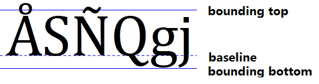

### Point

在传统纸质排版领域，字体的基本单位是 point，是一个真实的物理尺寸，跟英寸的关系如下：`1 pt = 1/72 inch`

也即若字体尺寸为 16 pt，则相应的物理尺寸为 1/6 inch，字符会被放置在行高为 1/6 inch 的区域内（见下图实线），不过由于某些字符本身就比较高些（比如含有重音符号的字符），这些字符需要额外的空间来表示，这部分额外的空间叫做 leading。此外字符被放置在行高区域内时，会有一个 baseline（见下图虚线），字符的某些部分为基线上，有些部分位于基线下：

由于显示器的物理尺寸和分辨率不同，导致不同设备上一个像素的物理尺寸是不同的,如果像传统排版系统那样使用真实物理尺寸来度量字体大小，是没有意义的，也即不同设备上同一物理尺寸，实际上对应了不同数量的像素单元）。

为此在计算机系统上，引入逻辑尺寸，也即抽象英寸单位。类似的可以定义：`1 pt = 1/72 logical inch`，至于一个抽象英寸单位到底对应多少像素单位，则由操作系统设置来决定，Windows 系统使用 96 像素单位来代表一个逻辑英寸单位，即：`1 logical inch = 96 pixel`，这个参数描述了一个逻辑英寸含有多少像素点（dots per inch），因此被叫做 DPI。由于不同设备上像素的物理尺寸存在差异，为了用户有更好的体验，操作系统一般都提供配置该参数的功能。

### PPI

PPI 是一个描述像素在设备上物理密度的值，可以用来度量设备的清晰度。

在数字图像中，基本的显示单元是像素。但由于显示器的物理尺寸和分辨率不同，导致不同设备上一个像素的物理尺寸是不同的。为此引入 PPI （即pixels per inch）来描述单位英寸内含有多少像素，显然对于某个设备来说，PPI 值由显示器大小以及分辨率共同决定的，是一个固定值。大多数 LCD 显示器的 PPI 值介于67到130之间，值越大则显示器越清晰。

同时在打印数字图像时，也会涉及到 PPI。PPI值会影响到打印图像的大小以及清晰度。比如 100x100 像素的图像打印时，如果 PPI 值设置为 10，则会打印出 10x10 英寸大小的图像，如果设置为 100，则会打印出 1x1 英寸的图像。

### DPI

DPI 是一个描述打印墨点密度的值，可以用来度量打印机的打印质量。

数字图像打印时，并不是每个数字图像中的像素点就对应一个打印机中的墨点，可以将墨点看成是更小的单位，数字图像的一个像素点由许多打印墨点来呈现。打印机参数 DPI（dots per inch）来决定单位英寸范围内应该含有多少打印墨点。DPI 越高，图像的色调越好，颜色之间的混合更平滑，同时打印过程会更慢。 一般家用打印机的 DPI 介于300到720之间。

