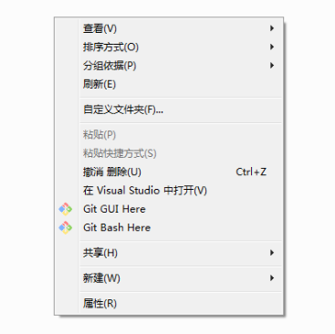

使用 Windows 系统时可以提高工作效率的一些小技巧：

**上下文环境菜单**

右击桌面或者文件系统空白处时，会弹出上下文环境菜单如下：

* 键盘导航：该菜单中的项目在尾部都标有一个字母，可以使用字母来导航相应菜单项

**文件系统**

* 将当前文件夹打开为一个新的窗口：`CTRL` + `N`
* 在当前文件夹中创建一个新的子文件夹（即新建文件夹）：`CTRL` + `SHIFT` + `N`
* 用快捷键来新建文本文件：首先需要修改注册表，打开 `regedit.exe` 注册表编辑程序，查找 `notepad.exe,-469`，找到注册表项后双击打开，将原本的内容 `文本文档` 改为 `T文本文档`，之后就可以可以在右击弹出的上下文菜单中有键盘导航新建文本文件了
* 文件夹的增强版上下文菜单：在文件夹上按下 `SHIFT` 键的同时右击鼠标，则弹出增强版上下文菜单。通过该菜单可以将文件夹发送到个人家目录，同时还可以在该文件夹下打开命令行
* 显示隐藏文件夹和文件：任意文件夹窗口顶部，组织->文件夹和搜索选项->查看->高级设置，找到相应的项目后勾选
* 显示文件的扩展名：任意文件夹窗口顶部，组织->文件夹和搜索选项->查看->高级设置，找到相应的项目勾选

**窗口**

* 窗口布局：用 `WIN` 键结合上下左右键可以改变多个窗口在视窗中的布局
* 双显示器窗口切换：`WIN` + `SHIFT` + 左右键
* 电脑显示器和投影仪之间切换：`WIN` + `P`
* 当前窗口最小化：`WIN` + `M`

**任务栏**

* 任务栏中程序之间切换：先用 `WIN` + `T` 选择程序，在按下 `ENTER` 键来完成切换
* 再次打开任务栏中的程序：按下 `SHIFT` 后，用鼠标单击想要打开的程序
* 光标移动到任务栏右侧的系统托盘：按下 `WIN` + `B`，之后可以使用左右键和 `ENTER` 来访问时间、声音、输入法等托盘项目

**任务管理器**

* 快捷键召唤任务管理器：`CTRL` + `SHIFT` + `ESC`

**搜狗输入法**

* 当在输入法软件中敲了很长文字，但想要将其删除：按下 `ESC` 键

