## 介绍

[MathJax](https://www.mathjax.org/)是用来在浏览器上渲染数学公式的Javascript库，使用简单灵活，只需要引入MathJax脚本就可以将网页中的[MathML](https://en.wikipedia.org/wiki/MathML)、[TeX/LaTeX](https://en.wikipedia.org/wiki/TeX)、[AsciiMath](http://asciimath.org/)语言转换为数学公式来显示，并且生成的数学公式仅使用了CSS、Web 字体以及 SVG 等技术（没有使用位图），因此生成的数据公式是支持缩放的。

## 安装

要想使用MathJax，既可将脚本下载到自己的主机并集成进项目中，也可以通过MathJax官方提供的CDN来进行集成。使用CDN的好处在于，可以让用户快速的加载脚本，并可以及时的使用到最新版本的MathJax。集成MathJax官方CDN十分简单，只需要将下面的代码添加到项目中：

```html
<script type="text/javascript" async
  src="https://cdn.mathjax.org/mathjax/latest/MathJax.js?config=TeX-MML-AM_CHTML">
</script>
```

其中URL参数`config=TeX-MML-AM_CHTML`用来配置MathJax行为，这里的意思是：识别页面中的TeX/LaTeX和MathML以及AsciiMath语法，将其输出为HTML和CSS以显示数学公式。想要对MathJax进行更多配置，请参见MathJax官网。

通过上面的配置，生成的数学公式会附带一个菜单，用户可以通过该菜单查看数学公式源码，进行语言偏好设置等，只要在数学公式上右击，就可以弹出如下菜单：

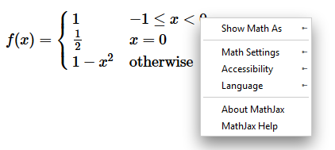

## 插入TeX/LaTeX

Tex/LaTeX为了区别于普通文本，使用了特殊的定界符来标识公式开始和结束位置，并且数学公式有两种显示方式：一种是行内的（in-line），即公式嵌入到文本行内；另一种是区块的（displayed），即独立成行显示公式。这两种显示方式分别使用不同的定界符用来标识，MathJax默认使用`$$`或者`\[`作为区块公式的开始定界符，区块公式相应的结束定界符为`$$`和`\]`，默认使用`\(`和`\)`来作为行内公式的开始和结束定界符。想要修改默认的定界符配置，需要在页面中插入类似下面的代码：

```html
<script type="text/x-mathjax-config">
// 配置$...$和\(...\)作为行内公式定界符
MathJax.Hub.Config({
  tex2jax: {inlineMath: [['$','$'], ['\\(','\\)']]}
});
</script>
```

然后就可以在页面的任意位置插入用定界符包裹的TeX/LaTeX内容，MathJax会在载入页面时识别页面的TeX/LaTeX内容并将其转换为输出内容以显示数学公式。

## Tex/LaTeX语法

### 速查手册

* [Detexify](http://detexify.kirelabs.org/classify.html)

  Detexify是一个LaTeX手写字符识别应用。应用会根据用户输入的手写字符，给出相应的LaTeX符号，这样使得用户在知道了LaTeX符号的大概外观后就可以迅速查询到对应的语法。十分好用，请访问：http://detexify.kirelabs.org/classify.html

* 组

  上下标等语法会作用于接下来的组，组指的是单个字符或者用`{`...`}`包围着的任意公式内容。也就是说`10^10`中的`^`只会将之后的`1`而不是`10`当成下一个组，而`10^{10}`中的`^`则将`10`当成下一个组，同样`x_i^2`和`x_{i^2}`不一样，`{x^y}^z`和`x^{y^z}`不一样

* 上下标

  在符号`_`之后下一个组的内容，将作为符号`_`之前内容的下标；同理在符号`^`之后下一个组的内容，将作为符号`^`之前内容的上标

* 括号

  小括号和方括号可以直接使用键盘上的符号`()`和`[]`，大括号通过`\{`...`\}`来输入。要注意的是，这样输入的括号不会随着公式的大小而自动伸缩，要想输入自动伸缩的括号，需要使用如下语法：`\left(`...`\right)`和`\left[`...`\right]`以及`\left\{`...`\right\}` 。此外`\left`...`\right`可以用来修饰其它成对符号，例如：绝对值符号`|`，向量取模符号`\vert`和`\Vert`，三角括号`\langle`...`\rangle`，取顶符号`\lceil`...`\rceil`，取底符号`\lfloor`...`\rfloor`，如果公式内部也含有需要自动缩放的内容就用`\middle`来修饰，例如：`\middle|`。并且可以通过符号`.`来隐藏配对符，`\left.x \right\}`将仅显示右侧大括号

* 求和求积分符号

  `\sum`表示求和符号，`\int`表示求积符号，`\prod`表示连乘符号，`\bigcup`表示求所有并集，`\bigcap`表示求所有交集，`\iint`表示重积分符号。以上符号后面的下标符号`_`标识下一个组内容是符号的下界，上标符号`^`标识下一个组内容是符号的上界，例如：`\sum_{i=0}^\infty i`表示对`i`从0到无限求和

* 分数

  可以用两种方式来表示分数。`\frac`会将紧跟在后面的两个组分别当作分子和分母，例如：`\frac ab`和`\frac {a}{b}`都表示`a/b`。此外可以直接在组内应用`\over`来表示分数，例如：`{a \over b}`也表示`a/b`。当在行内表示分数时，因为分数长的比较高，所以为了适应行高会自动缩放，要想强制分数以行内或者区块风格显示可以使用`\tfrac`和`\dfrac`。还有一种使用上下标表示分数的技巧：`^3/_7`或者`^3\!/_7`

* 根号

  二次根号示例：`\sqrt{x}`，三次根号示例：`\sqrt[3]{x}`。或者对于复杂公式建议使用组形式表示根号：`{x}^{1/3}`

* 排列组合

  `{n \choose k}`用来表示从n中选取k个元素。或者使用语法`\binom{n}{k}`

* 省略号

  在表示枚举序列或者连续相加或者相乘之类公式时，一般有省略号代替中间部分，位于公式底部位置省略号表示为`\ldots`，位于公式中部的省略号表示为`\cdots`

* 极限符号

  极限符号示例：`\lim_{x \to 0}`表示`x->0`的极限式

* 帽子符号

  单个字符使用`\hat`尖帽子修饰，公式字符较多使用`\widehat`尖帽子修饰。相应的可以使用：`\bar`添加平头帽子，`\overline`添加长平头帽子，`\vec`添加向量帽子，`\overrightarrow`添加长向量帽子，`\overleftrightarrow`添加双箭头帽子，`\dot`添加单点帽子，`\ddot`添加双点帽子

* 转义符

  MathJax中`\`充当转义符，要想输出`$`，`{`，`_`等具有特殊语义的符号，需要在其前面添加转义符`\$`，`\{`，`\_`。此外要想输出`\`本身，需要使用`\backslash`，而不能使用`\\`，因为`\\`用来表示换行符

* 颜色修饰

  公式都可以被颜色语法修饰：`{\color{red}content}`

* 空白符

  MathJax会忽略公式中的空白，不管公式中各个组内容之间含有多少空格，在转换为数学公式后都会丢失，为了强制在公式中插入空白，需要特定语法。`\,`表示窄空白，`\;`表示较宽的空白，`\quad`和`\qquad`表示更宽的空白。此外也可以使用`\text {some plain text}`语法来插入格式不会被改变的文本

### 例子

集合符号：`\forall x \in X, \quad \exists y \leq \epsilon`

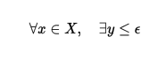

希腊字母：`\alpha, \Alpha, \beta, \Beta, \gamma, \Gamma, \pi, \Pi, \phi, \varphi, \mu, \Phi`

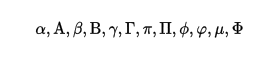

 三角函数：`\cos (2\theta) = \cos^2 \theta - \sin^2 \theta` 

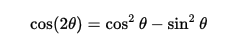

 极限：`\lim_{x \to \infty} \exp(-x) = 0`

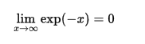

求余：`a \bmod b` 

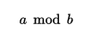

求余：`x \equiv a \pmod{b}`

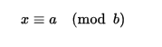

多项式：`k_{n+1} = n^2 + k_n^2 - k_{n-1}`  


组合符号：`\frac{n!}{k!(n-k)!} = \binom{n}{k}`


嵌套分数：

```latex
\begin{equation}
  x = a_0 + \cfrac{1}{a_1 
          + \cfrac{1}{a_2 
          + \cfrac{1}{a_3 + \cfrac{1}{a_4} } } }
\end{equation}
```

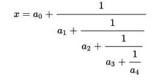

竖乘：

```latex
\begin{equation}
\frac{
    \begin{array}[b]{r}
      \left( x_1 x_2 \right)\\
      \times \left( x'_1 x'_2 \right)
    \end{array}
  }{
    \left( y_1y_2y_3y_4 \right)
  }
\end{equation}
```

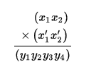

根号：`\sqrt[n]{1+x+x^2+x^3+\dots+x^n}`

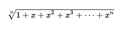

求和符号：`\sum_{i=1}^{10} t_i`

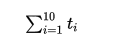

区块风格显示求和符：`\displaystyle\sum_{i=1}^{10} t_i`

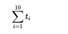

积分符号：`\int_0^\infty \mathrm{e}^{-x}\,\mathrm{d}x`

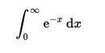

求和符多个子条件：

```latex
\sum_{\substack{
   0<i<m \\
   0<j<n
  }} 
 P(i,j)
```

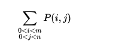

积分上下限表示：`\int\limits_a^b`

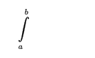

各种括号语法：

```latex
( a ), [ b ], \{ c \}, | d |, \| e \|,
\langle f \rangle, \lfloor g \rfloor,
\lceil h \rceil, \ulcorner i \urcorner
```

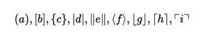

自动调整大小请使用`\left`，`\middle`，`\right`），手动调整括号大小如下：`( \big( \Big( \bigg( \Bigg(` 


矩阵：

```latex
\[
 \begin{matrix}
  a & b & c \\
  d & e & f \\
  g & h & i
 \end{matrix}
\]
```

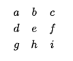

```latex
A_{m,n} = 
 \begin{pmatrix}
  a_{1,1} & a_{1,2} & \cdots & a_{1,n} \\
  a_{2,1} & a_{2,2} & \cdots & a_{2,n} \\
  \vdots  & \vdots  & \ddots & \vdots  \\
  a_{m,1} & a_{m,2} & \cdots & a_{m,n} 
 \end{pmatrix}
```

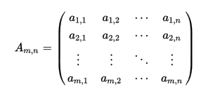

行内矩阵：`\bigl(\begin{smallmatrix}a&b \\ c&d\end{smallmatrix}\bigr)`

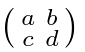

格式化文本：`\text{raw text} \, \textrm{roman text} \, \textit{itaic text} \, \textbf{bold text}`

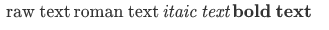

### 常用字体

注：字体语法用来修饰接下来的一个组内容

| 字体名                  | 字体语法             |
| -------------------- | ---------------- |
| blackboard bold      | `\mathbb`或`\Bbb` |
| boldface             | `\mathbf`        |
| typewriter           | `\math`          |
| roman                | `\mathrm`        |
| sans-serif           | `\math`          |
| calligraphic letters | `\mathcal`       |
| script letters       | `\mathscr`       |
| Fraktur letters      | `\mathfrak`      |

### 关系符号表

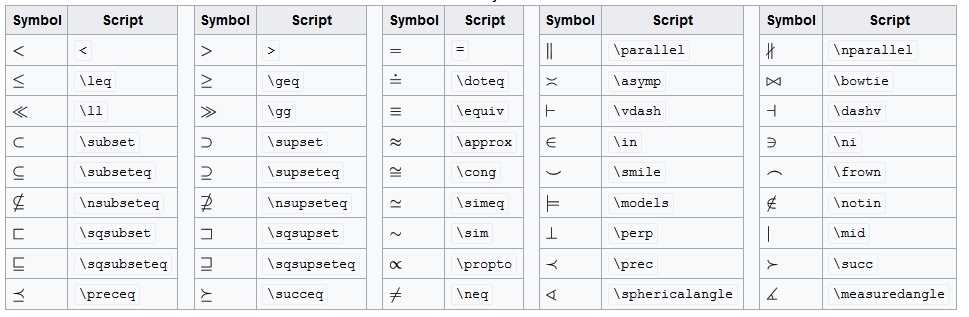

###  二元操作符

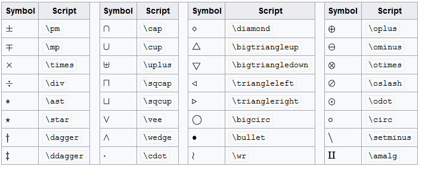

### 集合逻辑操作符

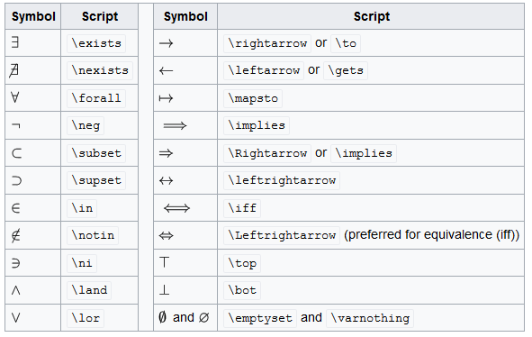

###  定界符

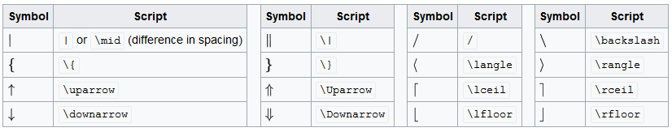

### 希腊罗马符号

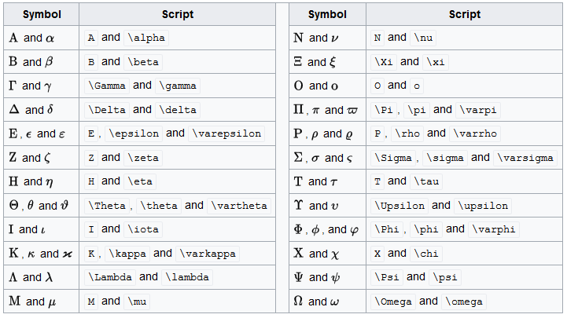

### 三角函数

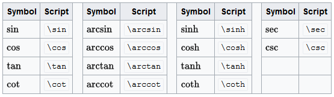

### 点


### 其它符号

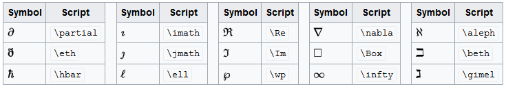

### 更多查询

关于更多语法内容，请参考：https://en.wikibooks.org/wiki/LaTeX/Mathematics