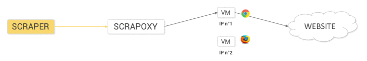
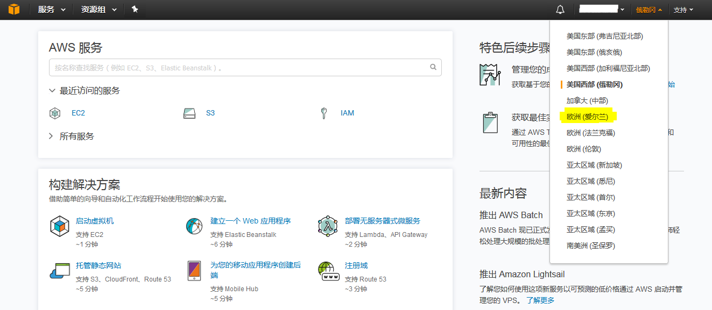
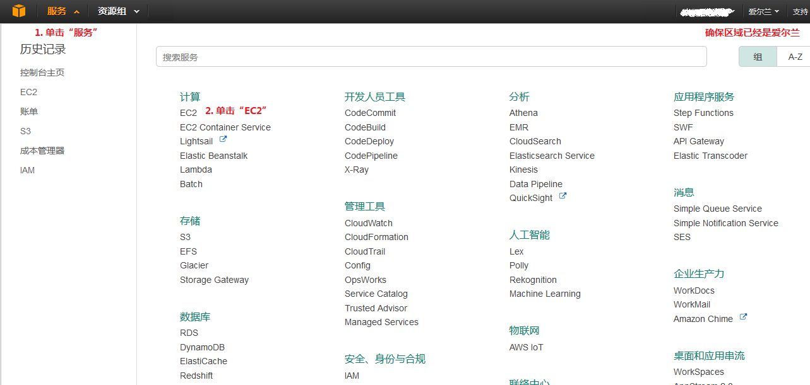
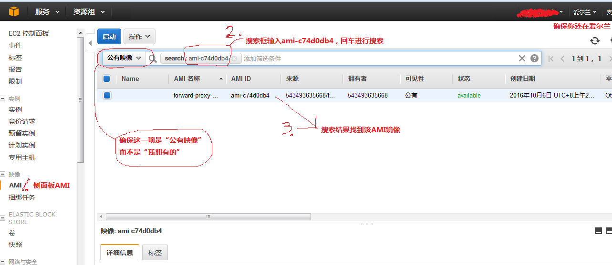
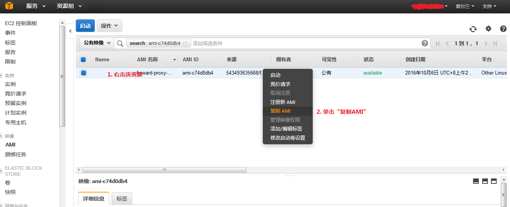
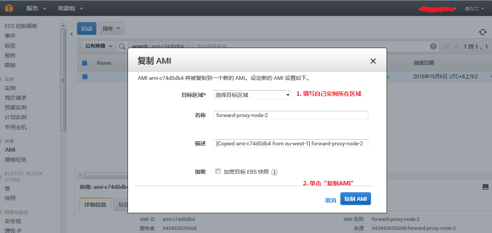

## 简介

现在如今爬虫的使用场景随处可见，从搜索引擎构建内容索引到数据分析都要涉及到数据的爬取。从数据爬取方来看，使用爬虫是一种低廉而且便捷的数据获取方式。但从数据被爬取方来看，某些恶意爬虫高频的访问网站，占用了网络带宽，导致正常用户的访问体验下降，而且对于某些网站，数据是自己的核心竞争力，因此数据被爬取方可能会出于某些原因不想要自己的网站被爬取。这样在数据爬取方和被爬取方之间就形成了相互比拼的状态，数据被爬取方使用各种方法来屏蔽那些恶意爬虫，同时数据爬取方则绞尽脑汁来绕过这些屏蔽规则，彼此之间的策略都在不断的升级进化，可以说这是一场没有结束的竞赛。

一般而言，数据被爬取方使用最为常见的屏蔽策略就是限制来自某个 IP 的请求频率，当检测到某个 IP 请求频率异常时，通常会采取直接封锁或者要求输入验证码来是否为正常人类访问。数据爬取方为了应对这个问题，通常需要在请求头信息中添加一些信息将自己伪装成正常浏览器用户，并需要调整自己请求频率使得可以在不被封锁的前提下尽可能快速的去爬取内容，但对于爬取方来说较低的爬取速度代表着低生产率，是不可接受的。数据爬取方为了绕过访问频率限制最为常用的方案就是分布式部署爬虫，将爬虫部署到大量主机上，每个主机只发起较少的网络请求，这样就可以成功绕过访问频率限制，这其实是一种平摊机制，将网络请求任务平摊到许多主机上来降低单台主机的数据请求次数。

但在大多数情况下，数据爬取者不想要承担租赁大量主机带来的成本，当然现在爬虫云服务的出现使得爬虫的部署可以节省很多成本，而且这些爬虫云服务厂商还提供了许多机制来优化爬虫的运行，例如：[Crawlera](https://scrapinghub.com/crawlera/) 就是一款好用的爬虫云服务厂商，大量的云主机以及复杂的请求分发机制为爬虫的运行提供了便捷高效的环境。当然好用的服务也是要收费的，Crawlera 最低配的服务要收取 $25/month 的费用。而使用 [Scrapoxy](http://docs.scrapoxy.io/en/master/) 构建自己的爬虫代理池是完全免费的，简单来说 Scrapoxy 基于云主机来构建一个代理池，爬虫通过 Scrapoxy 发起的网络请求会被 Scrapoxy 分发到这些代理云主机，并且 Scrapoxy 提供动态删除/添加云主机的功能，使得不可用的云代理可以被及时的移除，以此来保证代理池的高可用性。

下面是爬虫通过Scrapoxy发起网络请求的示意图（图片来自[官网](http://docs.scrapoxy.io/en/master/_images/arch.gif)）

附注：爬虫发起的网络请求通过 Scrapoxy 分发给各个代理云主机，同时 Scrapoxy 负责创建并管理代理池。

## 配置云主机

目前 Scrapoxy 支持[AWS](https://aws.amazon.com), [DigitalOcean](https://www.digitalocean.com), [OVH](https://www.ovh.com), [Vscale](https://vscale.io)云平台提供的云主机来构建代理池。鉴于 AWS 注册后赠送一年的云服务，其中包含750小时/月的免费主机运行时间，本文主要针对 AWS 云平台进行介绍，其它云平台的配置参见[这里](http://docs.scrapoxy.io/en/master/index.html)。

附注：如果是全天使用 AWS 云主机的话，750小时仅够运行一个云主机，我们用来构建代理池需要运行一个以上云主机，所以如果要全天运行爬虫项目的话，显然会超过750小时的免费时间，可以考虑购买 AWS 的云服务，如果爬虫不需要全天运行的话，建议及时关闭云主机，避免运行时间的浪费。

### AWS术语及概念

在介绍如何创建AWS代理主机之前，先来简单介绍 AWS 的一些术语和概念（下面简单搬运了一些AWS[官网介绍](http://docs.aws.amazon.com/zh_cn/AWSEC2/latest/UserGuide/concepts.html)过来）

* EC2实例

  AWS中的云计算单元，是可扩展的虚拟主机又被称为实例。

* 实例类型

  定义虚拟主机CPU、内存、存储、网络带宽等硬件相关参数，不同实例类型代表不同的计算和存储能力。

* AMI

  虚拟主机的系统镜像，包含操作系统以及常用软件，可以看成是实例的预配置模板，AWS社区提供了各种各样的AMI供公众使用。

* 区域

  Amazon EC2 托管在全球多个位置，这些位置由不同区域构成，每个区域都对应一个独立的地理区域。每个区域都被设计为与其他区域完全隔离，区域之间的所有通信都是通过公共 Internet 进行的。而且当我们查看资源时，只会看到我们指定区域相关联的资源，因为区域间彼此隔离，资源不会自动跨区域复制。当我们启动实例时，必须选择位于同一地区的 AMI 资源，如果 AMI 在其他区域，就需要我们先将该 AMI 复制到实例所在区域才能使用它。区域代码样例：`us-west-1`

* 可用区

  每个区域都有多个相互隔离的位置，称为可用区。当启动实例时，可以自己选择一个可用区或让AWS自动选择。如果实例分布在多个可用区域且其中的某个实例发生故障，可以设计自己的应用，使另一可用区域中的实例可代为处理相关请求。可用区由区域代码后跟一个字母标识符表示，例如：`us-west-1a`

* 安全组

  安全组是虚拟防火墙，可以为安全组添加各种规则，用来控制实例流入或流出的流量，每个安全组可以关联一个或多个实例。在启动实例时，将一个或多个安全组与该实例相关联，之后可以随时修改安全组的规则，新规则会自动应用于与该安全组相关联的所有实例。

* AWS账户安全凭证

  在与 AWS 交互时，指定 AWS 安全凭证以验证账户身份以及是否有权访问所请求的资源。

### 第一步：复制代理镜像

我们的AWS云代理池实例需要使用一个拥有代理功能的AMI镜像，Scrapoxy 官网介绍位于AWS `eu-west-1`区域ID为 `ami-c74d0db4` 的AMI镜像资源可以用来创建代理实例，如果你的实例不是运行在 `eu-west-1` 区域的话，就需要先从该区域复制镜像到自己实例所在区域，具体操作步骤如下：

打开[AWS控制台](https://console.aws.amazon.com/)，切换至欧洲（爱尔兰）区域

然后打开EC2面板

然后单击侧边栏中的AMI，并在打开的窗口中搜索公有AMI资源 `ami-c74d0db4`

接下来将该AMI资源复制到自己实例所在区域

