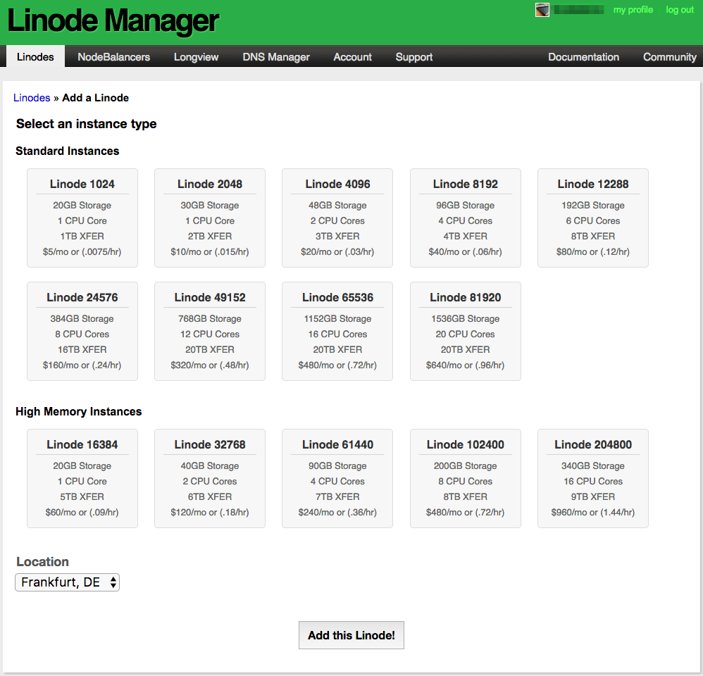
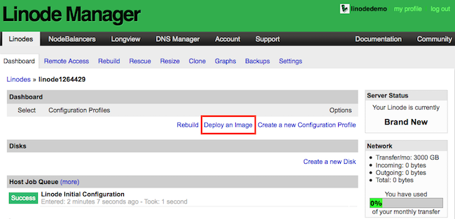
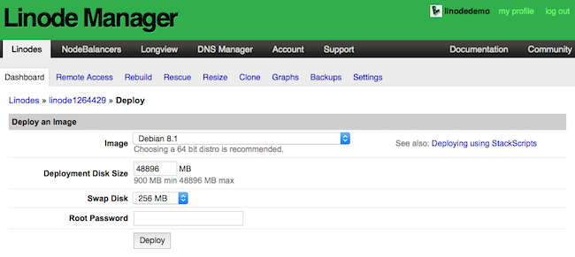
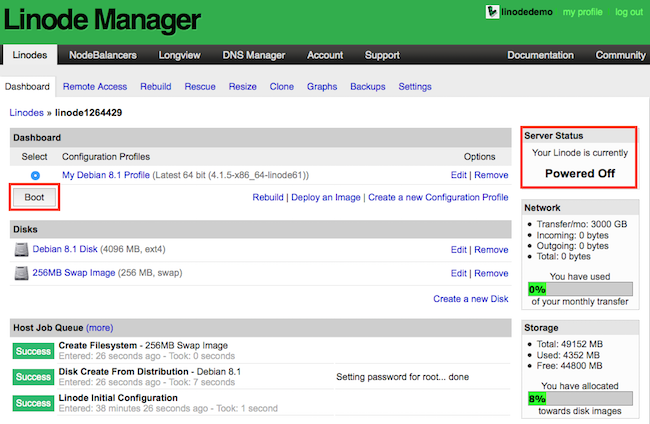
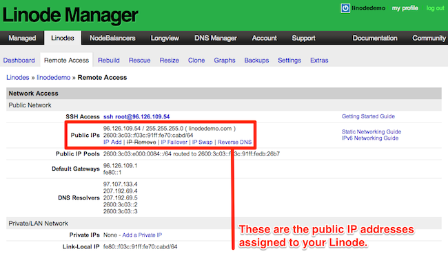
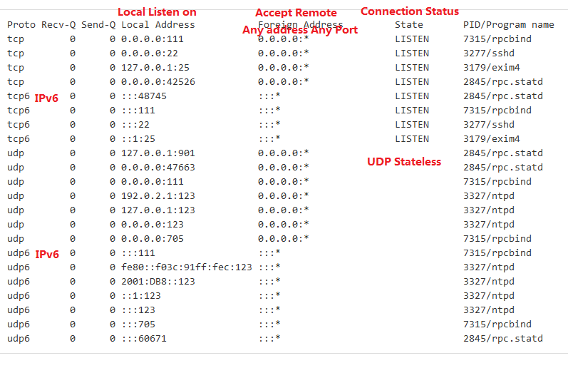
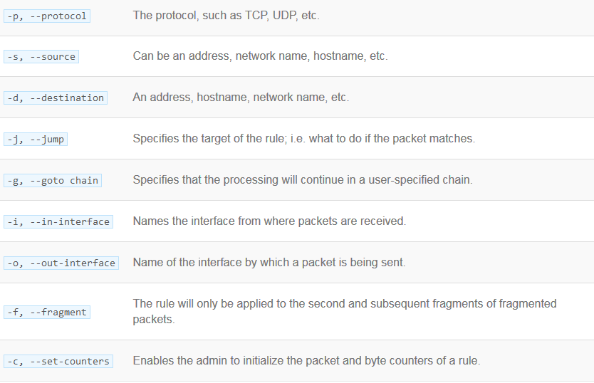
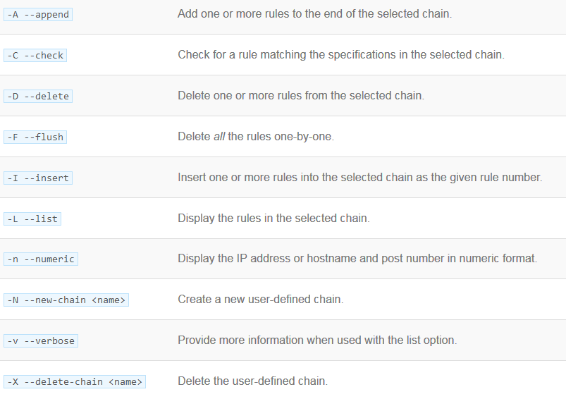

##  Linode主机搭建

### Linode云服务

[Linode](https://www.linode.com/)是以性能稳定著称的Linux虚拟云主机提供商，下面将一步一步讲解如何在Linode上搭建一个功能完备的虚拟主机

### Linode Web控制台

Web控制台的访问地址：https://manager.linode.com/

### 创建虚拟主机 

创建虚拟主机时，需要选择数据中心的物理位置（Location），应该尽量选择对于虚拟主机目标用户访问延时较小的位置，Linode提供了工具用来测试不同数据中心的访问性能：https://www.linode.com/speedtest



### 部署Linux镜像

Linode目前支持的Linux发行版有：Arch Linux](http://www.archlinux.org/), [CentOS](http://www.centos.org/), [Debian](http://www.debian.org/), [Fedora](http://fedoraproject.org/), [Gentoo](http://www.gentoo.org/), [openSUSE](http://www.opensuse.org/), [Slackware](http://www.slackware.com/) , [Ubuntu](http://www.ubuntu.com/)

超级用户密码规则：长度至少6个字符；必须包含大小写英文字母、数字以及标点符号这三类字符中的两类。超级用户密码在随后通过SSH客户端登录时将会用到，请谨记！





### 启动虚拟主机



### 虚拟主机IP地址

Linode为虚拟主机提供了固定的IPv4/IPv6地址，IPv6能否使用取决于互联网提供商（Internet Service Provider）



### SSH连接虚拟主机

主机维护人员一般需要通过加密的SSH协议（Secure Shell Protocol）跟远程主机通信。

一般情况下Linux和Mac系统自带SSH客户端工具；Windows用户需要安装[PuTTY](http://www.chiark.greenend.org.uk/~sgtatham/putty/latest.html)来作为SSH客户端工具（Linode官方提供了使用PuTTY的[教程](https://www.linode.com/docs/networking/ssh/using-putty/)）。

### 更新系统软件

出于系统安全的考虑，应该在初次安装系统后，立即更新系统软件，并且在后续使用中应该定期更新系统软件，各个Linux发行版更新命令如下：

```shell
# Ubuntu / Debian
apt-get update && apt-get upgrade
# CentOS / Fedora
yum update
# Arch
pacman -Syu
# Gentoo
emaint sync
emerge --uDN @world
# Slackware
slackpkg update
slackpkg upgrade-all
```

### 设置hostname

* Arch / CentOS 7 / Debian 8 / Fedora version 18+ / Ubuntu 15.04+

  ```shell
  hostnamectl set-hostname your-hostname 
  ```

* Debian 7 / Slackware / Ubuntu 14.04

  ```shell
  # update hostname file
  echo "your-hostname" > /etc/hostname
  # update runtime hostname
  hostname -F /etc/hostname
  # 注释文件/etc/default/dhcpcd中的SET_HOSTNAME=yes
  ```

* CentOS 6 / Fedora 17-

  ```shell
  # update hostname configuration
  echo "HOSTNAME=your-hostname" >> /etc/sysconfig/network
  # update runtime hostname
  hostname "your-hostname"
  ```

* Gentoo

  ```shell
  # update hostname file
  echo "HOSTNAME=\"your-hostname\"" > /etc/conf.d/hostname
  # restart hostname service
  /etc/init.d/hostname restart
  ```

**注**：系统的host name跟托管该主机上的网站以及邮件服务没有任何关系，仅仅作为主机的名字而已

### 配置hosts文件

文件`/etc/hosts`中保存了IP地址到域名的映射，这些映射关系的优先级高于DNS查询，也即如果该文件中记录了某个域名到IP地址的映射，那么该域名的IP地址就不会通过DNS服务获取而是直接读取该文件中的IP地址。hosts文件中应该已经有一行内容`127.0.0.1 localhost.localdomain localhost`用来表示本地环回地址。

我们需要在hosts文件中为主机添加一条关于它自己公有IP地址的映射关系，假设当前主机的IP地址是`123.45.67.89`，我们为主机设置的host name是`test-server`，当前主机所在网络的域名为`mycompany.local`，则主机本地的FQDN是`test-server.mycompany.local`，为了使得本机host name以及FQDN可以映射到本机公有IP地址，需要将以下内容追加到hosts文件：

```
 123.45.67.89 test-server.mycompany.local test-server
```

**注**：主机的FQDN同host name一样都是对主机命名，为主机指定的FQDN同托管在主机上的网站、邮箱等服务没有必然联系

### 配置时区

Linode上的Linux镜像默认时区设置为UTC时间，将时区更改为主机目标用户群所在时区会更加可取，下面是各个Linux发行版配置时区的方法：

* Debian / Ubuntu

  ```shell
  dpkg-reconfigure tzdata
  ```

* Arch Linux and CentOS 7

  ```shell
  # list avaiable timezones
  timedatectl list-timezones
  # set timezone
  timedatectl set-timezone 'America/New_York'
  ```

* Gentoo

  ```shell
  # list avaiable timezones
  ls /usr/share/zoneinfo
  # write timezone into file
  echo "EST" > /etc/timezone
  # set /etc/localtime
  emerge --config sys-libs/timezone-data
  ```

* 其它发行版

  ```shell
  # list avaiable timezones
  ls /usr/share/zoneinfo
  # link zoneinfo file to localtime file
  ln -sf /usr/share/zoneinfo/EST /etc/localtime
  ```

**注**：时区设置完成后可以通过命令`date`检查一下是否设置成功

### 添加管理员账户

在创建虚拟主机时，生成的root账户对主机拥有最高权限，可以在主机上执行任何命令，为了避免由于不当使用root账户误操作而危害系统，建议创建一个权限较低的管理员账户来进行日常的主机管理，如果需要使用某个权限较高的命令，则通过`sudo`命令来执行（使用`sudo`的日志文件`/var/log/auth.log`），使用这样的受限制账户管理主机更加安全。下面是在各个Linux发行版下用root账户创建用户的命令：

* CentOS / Fedora

  ```shell
  # create user and assign password
  useradd admin_username && passwd admin_username
  # add user to the wheel group that has sudo privileges
  usermod -aG wheel admin_username
  ```

* Ubuntu

  ```shell
  # create user
  adduser admin_username
  # add user to the sudo group for administrative privilieges
  adduser admin_username sudo
  ```

* Debian

  ```shell
  # install sudo
  apt-get install sudo
  # create user
  adduser admin_username
  # add user to the sudo group for administrative privileges
  adduser admin_username sudo
  ```

### 更改SSH登录方式

默认SSH以密码授权的方式登录远程主机，一种更加安全的方式是使用公钥/私钥键对来进行登录，简单来说这种方式就是，将用于登录远程主机的计算机的公钥上传到远程主机，这样以后登就可以直接登录远程主机了。

* 首先在本地用户主目录查看是否已经存在公钥/私钥键对文件：`ls ~/.ssh/id_rsa*`

* 如果本地没有公钥/私钥键对文件，则需要创建它们

  对于Linux和Mac OS X直接运行命令：`ssh-keygen -b 4096`

  对于Windows，需要使用PuTTY的一个程序PuTTYgen来生成秘钥

  **注**：在创建秘钥过程中，会提示输入一个`passphrase`用来对私钥进行加密，这是一个保护机制，即使别人能拿到你的私钥，却不知道私钥的`passphrase`，是无法使用的

* 将本地的公钥上传到远程主机管理用户的主目录

  对于Linux，直接在本地运行命令：`ssh-copy-id admin_username@123.45.67.89`

  对于Mac OS X，首先要在远程主机上创建`.ssh`目录：`mkdir -p ~/.ssh && sudo chmod -R 700 ~/.ssh`，然后再将本地公钥上传到远程主机：`scp ~/.ssh/id_rsa.pub admin_username@123.45.67.89:~/.ssh/authorized_keys`

  对于Windows，可以借助软件[WinSCP](https://winscp.net/eng/docs/lang:chs)，或者用SSH登录远程主机手动将本地公钥写入文件`authorized_keys`中：`mkdir ~/.ssh; vi ~/.ssh/authorized_keys`

  **注**：此外还要更改远程主机管理账户`.ssh`目录权限，使得其它用户不能够访问该目录：`sudo chmod 700 -R ~/.ssh && chmod 600 ~/.ssh/authorized_keys`

### SSH守护进程配置

* 禁止root账户通过SSH登录

  要想使用root用户的权限，只有通过非root用户SSH登录后，使用`sudo`命令或者使用`su -`切换到root用户，在配置文件`/etc/ssh/sshd_config`中添加一行内容：`PermitRootLogin no`

* 禁用SSH密码授权登录方式

  禁用密码授权登录方式后，只能通过上传公钥到远程主机进行登录，虽然这样可以更加安全，但也却不是十分便利，如果经常在不同电脑上登录到远程主机的话，就需要将这些电脑上的公钥都上传到远程主机。如果真想禁用密码授权方式的话，在配置文件`/etc/ssh/sshd_config`中添加一行内容：`PasswordAuthentication no`

* 配置SSH监听的协议

  默认情况下SSH守护进程监听来自IPv4和IPv6的连接，可以配置`/etc/ssh/sshd_config`使得SSH守护进程只监听其中一个协议：

  ```
  # listen only IPv4
  AddressFamily inet
  # listen only IPv6
  AddressFamily inet6
  ```

* 重启SSH守护进程

  为了使配置生效，需要重启SSH守护进程：

  ```shell
  # CentOS 7, Debian 8, Fedora, Ubuntu 15.10+
  sudo systemctl restart sshd

  # CentOS 6, Debian 7, Ubuntu 14.04
  sudo service ssh restart
  ```

### Fail2ban更进一步保护

Fail2ban通过分析日志内容来监测系统可能受到的攻击，一旦发现攻击，Fail2ban会将预定义的规则添加到防火墙来屏蔽攻击者IP，同时检测到攻击时Fail2ban还可以发送邮件给系统管理员。

#### 安装Fail2ban

各个Linux发行版安装Fail2ban步骤如下：

* CentOS 7

  ````shell
  # update system and install EPEL repository
  yum update && yum install epel-release
  # install Fail2ban
  yum install fail2ban
  # install sendmail(not required)
  yum install sendmail
  # start and enable Fail2ban&sendmail
  systemctl start fail2ban
  systemctl enable fail2ban
  systemctl start sendmail
  ssytemctl enable sendmail
  ````

* Debian

  ```shell
  # update system
  apt-get update && apt-get upgrade -y
  # install Fail2ban
  apt-get install fail2ban
  # install sendmail(not required)
  apt-get install sendmail-bin sendmail
  ```

* Fedora

  ```shell
  # update system
  dnf update
  # install Fail2ban
  dnf install fail2ban
  # install sendmail(not required)
  dnf install sendmail
  # start and enable Fail2ban&sendmail
  systemctl start fail2ban
  systemctl enable fail2ban
  systemctl start sendmail
  systemctl enable sendmail
  ```

* Ubuntu

  ```shell
  # update system
  apt-get update && apt-get upgrade -y
  # install Fail2ban
  apt-get install fail2ban
  # install sendmail(not required)
  apt-get install send-mail
  # allow SSH access throught UFW and enable firewall
  ufw allow ssh
  ufw enable
  ```

#### 配置Fail2ban

Fail2ban的配置文件位于目录`/etc/fail2ban`，其中`*.local`配置文件的内容会重写`*.conf`的内容，一般安装后好Fail2ban后会自带若干`*.conf`文件，我们的配置一般都是通过复制这些文件来创建`*.local`文件，以此为起点添加自己的配置。

* 配置文件fail2ban.local

  创建配置文件：

  `cp /etc/fail2ban/fail2ban.conf /etc/fail2ban/fail2ban.local`

  可修改配置项：

  `loglevel`，`logtarget`，`socket`，`pidfile`

* 配置文件jail.local

  创建配置文件：

  `cp /etc/fail2ban/jail.conf /etc/fail2ban/jail.local`

  配置项：

  ```
  # 修改backend配置项
  backend = systemd

  # 开启Fail2ban对SSH的监测
  [sshd]
  enabled = true

  # IP白名单，白名单中的IP不会被Fail2ban应用屏蔽规则
  # "ignoreip" can be an IP address, a CIDR mask or a DNS host. Fail2ban will not
  # ban a host which matches an address in this list. Several addresses can be
  # defined using space separator.
  ignoreip = 127.0.0.1/8 123.45.67.89

  # 设置攻击者被屏蔽的时间（秒），负数表示永久屏蔽
  bantime  = 600

  # 在findtime秒内，登录次数超出上限maxretry将被屏蔽
  findtime = 600
  maxretry = 3

  # 警报邮箱设置
  destemail = receiver@163.com
  sendername = fail2ban
  # 在主机上运行sendmail -t your@email.com，登录邮箱查看发件人，发件人就是sender
  sender = your-should-check-it
  action = %(action_mw)s
  ```

#### 自定义过滤器

过滤器（filter）就是用来解析日志文件发现异常行为的规则，Fail2ban在目录`/etc/fail2ban/filter.d`中预定了很多常见的过滤器，例如有针对分析SSH守护进程日志的过滤器`/etc/fail2ban/filter.d/sshd.conf`，有时预定的过滤器不能满足需求，这时可以定义自己的过滤器。

假设我们要用Fail2ban监测Wordpress搭建的博客（考虑到Fail2ban会消耗CPU性能，因此在实战中并不推荐用Fail2ban来监测Wordpress），首先要分析博客后台产生的日志，找出其中一次登录成功的日志消息：

```
123.45.67.89 - - [01/Oct/2015:12:46:34 -0400] "POST /wp-login.php HTTP/1.1" 200 1906 "http://example.com/wp-login.php" "Mozilla/5.0 (Macintosh; Intel Mac OS X 10.10; rv:40.0) Gecko/20100101 Firefox/40.0"
```

然后编写用来匹配这行内容的正则表达式（使用Python正则语法，其中`<HOST>`预定义用来匹配任何主机地址）：

```
<HOST> - - \[(\d{2})/\w{3}/\d{4}:\1:\1:\1 -\d{4}\] "POST /wp-login.php HTTP/1.1" 200
```

现在可以创建过滤器了，在目录`/etc/fail2ban/filter.d`创建文件`wordpress.conf`，并写入以下内容：

```
[Definition]
        
failregex = <HOST> - - \[(\d{2})/\w{3}/\d{4}:\1:\1:\1 -\d{4}\] "POST /wp-login.php HTTP/1.1" 200
ignoreregex =
```

然后在`/etc/fail2ban/jail.local`中开启对wordpress的监测：

```
[wordpress]
enabled  = true
filter   = wordpress
logpath  = /var/www/html/andromeda/logs/access.log
port     = 80,443
```

#### Fail2ban客户端

Fail2ban附带了客户端工具来跟Fail2ban服务交互，使用手册如下：

```shell
# 启动Fail2ban server和jails
fail2ban-client start
# 重新加载配置文件
fail2ban-client reload
# 重新加载某个jail
fail2ban-client reload the-jail-name
# 终止Fail2ban server
fail2ban-client stop
# 查看状态
fail2ban-client status
# 查看某个jail状态
fail2ban-client status the-jail-name
```

### 移除主机上无用的网络服务

Linux主机往往会开启网络端口来监听各种网络服务，为了最小化系统风险，主机上用不到的网络服务应该将其关闭

* 查看主机上运行的网络服务

  输入命令：`sudo netstat -tupln`

  假设返回结果如下：

  可以看到主机上主要运行了RPC，SSH，NTPdate，Exim4几个网络服务

* 移除无用服务

  由于要通过SSH登录主机，所以SSH是必须的；NTPdate用于同步系统时间，精度可达到纳秒级别，如果不需要这么高的精度，可以考虑另一个精度较低且不需要开启网络端口的服务[OpenNTPD](https://en.wikipedia.org/wiki/OpenNTPD)，至于RPC和Exim4均可以将其移除。各个Linux发行版移除软件命令如下：

  ```shell
  # Arch
  sudo pacman -Rs package_name
  # CentOS
  sudo yum remove package_name
  # Debian / Ubuntu
  sudo apt-get purge package_name
  # Fedora
  sudo dnf remove package_name
  ```

  再次运行`sudo netstat -tupln`看是否已经成功移除网络服务软件

### 防火墙

#### iptables简介

[iptables](https://en.wikipedia.org/wiki/Iptables)是用来为内核包过滤框架[netfilter](http://netfilter.org/)配置规则的程序，扮演着防火墙或者控制网络流量的角色。

过滤过程就是比较数据包是否跟配置的规则匹配，一般就是查看数据包中源地址、目标地址、协议类型、端口以及网卡接口等信息是否跟某条规则匹配，当规则匹配后会执行相应的动作，也许会接受、丢弃数据包或者跳转到别的规则继续匹配等。规则（Rule）由匹配条件和匹配成功后的动作组成，而且规则被按照链（Chain）分组，在检查数据包时会从前往后依次（这一点要谨记！）测试链中的规则，如果匹配就执行相应的动作且不再继续检查链的其它规则，当数据包不匹配链中的任何规则时，就是执行链的默认策略（default policy）。

iptables的配置可以直接使用命令行工具`iptables`，以及针对IPv6的版本`ip6tables`

iptables配置的防火墙规则按照table->chain->rule结构来组织，iptables内置了Filter, Nat, Mangle, Raw, Security等table，最常用就是Filter table（而且是默认table），该table主要含有以下chains：

* Input Chain, 应用于流向本地接口的数据包
* Forward Chain, 应用于从本地路由出去的数据包
* Output Chain, 应用于本地生成的数据包

#### iptables参数





#### iptables规则增删改查

```shell
# display rules
sudo iptables -L -nv
# display rules with numerical order
sudo iptables -L -nv --line-numbers

# add a rule to the beginning of INPUT chain: drop all packets from 178.36.28.12
sudo iptables -I INPUT -s 178.36.28.12 -j DROP
# add a rule in the order 7 of INPUT chain: accept packets from port 8080 over TCP protocol
sudo iptables -I INPUT 7 -p tcp --dport 8080 -m state --state NEW -j ACCEPT

# replace a rule in the order 7 of INPUT chain
sudo iptables -I INPUT 7 -m limit --limit 3/min -j LOG --log-prefix "iptables_INPUT_denied: " --log-level 7

# delete 7th rule from INPUT chain
sudo iptables -D INPUT 7
sudo iptables -D INPUT 7 -p tcp --dport 8080 -m state --state NEW -j ACCEPT
```

#### iptables配置示例

当主机刚刚搭建后之后iptables是没有规则的，也即所有流入、转发以及流出的数据包都是被允许的，根据主机的不同应用场景，应该为主机配置不同的防火墙规则，下面介绍常见的一些规则

```shell
# 在INPUT链尾部追加一条规则：将使用TCP协议、目标端口为110且使用网卡eth0的所有数据包丢弃
sudo iptables -A INPUT -j DROP -p tcp --destination-port 110 -i eth0
# 如果同一网卡上设置了多个虚拟IP接口，则需要另外指定相应的IP
sudo iptables -A INPUT -j DROP -p tcp --destination-port 110 -i eth0 -d 198.51.100.0
# 将来自198.51.100.0的数据包都丢弃
sudo iptables -I INPUT -s 198.51.100.0 -j DROP
```

或者通常我们想要只接受符合某些规则的数据包而把其余数据包都丢弃

```shell
sudo iptables -A INPUT -m state --state ESTABLISHED,RELATED -j ACCEPT
sudo iptables -A INPUT -i lo -m comment --comment "Allow loopback connections" -j ACCEPT
sudo iptables -A INPUT -p icmp -m comment --comment "Allow Ping to work as expected" -j ACCEPT
# accept the following destination ports
sudo iptables -A INPUT -p tcp -m multiport --destination-ports 22,25,53,80,443,465,5222,5269,5280,8999:9003 -j ACCEPT
sudo iptables -A INPUT -p udp -m multiport --destination-ports 53 -j ACCEPT
# accept the following source addresses
sudo iptables -A INPUT -s 192.168.1.0/24 -j ACCEPT
sudo iptables -A INPUT -s 198.51.100.0 -j ACCEPT
# default policy for INPUT and FORWARD chain
sudo iptables -P INPUT DROP
sudo iptables -P FORWARD DROP
```

#### Web Server防火墙规则模板

**注**：以下防火墙规则模板主要适用于作web server的主机，不适用于作数据库或者VPN的主机

IPv4版本

```
*filter

# Allow all loopback (lo0) traffic and reject traffic
# to localhost that does not originate from lo0.
-A INPUT -i lo -j ACCEPT
-A INPUT ! -i lo -s 127.0.0.0/8 -j REJECT

# Allow ping.
-A INPUT -p icmp -m state --state NEW --icmp-type 8 -j ACCEPT

# Allow SSH connections.
-A INPUT -p tcp --dport 22 -m state --state NEW -j ACCEPT

# Allow HTTP and HTTPS connections from anywhere
# (the normal ports for web servers).
-A INPUT -p tcp --dport 80 -m state --state NEW -j ACCEPT
-A INPUT -p tcp --dport 443 -m state --state NEW -j ACCEPT

# Allow inbound traffic from established connections.
# This includes ICMP error returns.
-A INPUT -m state --state ESTABLISHED,RELATED -j ACCEPT

# Log what was incoming but denied (optional but useful).
-A INPUT -m limit --limit 5/min -j LOG --log-prefix "iptables_INPUT_denied: " --log-level 7

# Reject all other inbound.
-A INPUT -j REJECT

# Log any traffic that was sent to you
# for forwarding (optional but useful).
-A FORWARD -m limit --limit 5/min -j LOG --log-prefix "iptables_FORWARD_denied: " --log-level 7

# Reject all traffic forwarding.
-A FORWARD -j REJECT

COMMIT
```

IPv6版本

```
*filter

# Allow all loopback (lo0) traffic and reject traffic
# to localhost that does not originate from lo0.
-A INPUT -i lo -j ACCEPT
-A INPUT ! -i lo -s ::1/128 -j REJECT

# Allow ICMP
-A INPUT -p icmpv6 -j ACCEPT

# Allow HTTP and HTTPS connections from anywhere
# (the normal ports for web servers).
-A INPUT -p tcp --dport 80 -m state --state NEW -j ACCEPT
-A INPUT -p tcp --dport 443 -m state --state NEW -j ACCEPT

# Allow inbound traffic from established connections.
-A INPUT -m state --state ESTABLISHED,RELATED -j ACCEPT

# Log what was incoming but denied (optional but useful).
-A INPUT -m limit --limit 5/min -j LOG --log-prefix "ip6tables_INPUT_denied: " --log-level 7

# Reject all other inbound.
-A INPUT -j REJECT

# Log any traffic that was sent to you
# for forwarding (optional but useful).
-A FORWARD -m limit --limit 5/min -j LOG --log-prefix "ip6tables_FORWARD_denied: " --log-level 7

# Reject all traffic forwarding.
-A FORWARD -j REJECT

COMMIT
```

为了将以上规则导入到iptables，不同Linux发行版需要执行不一样的步骤，执行完以下步骤后记得使用命令`sudo iptables -vL `查看规则是否设置成功

* Debian / Ubuntu

  将以上模板内容分别保存为`/tmp/v4`和`/tmp/v6`，然后执行命令：

  ```shell
  sudo iptables-restore < /tmp/v4
  sudo ip6tables-restore < /tmp/v6
  ```

  此外Debian和Ubuntu可以使用另外一个防火墙配置工具[UFW](https://help.ubuntu.com/community/UFW)来[配置](https://www.linode.com/docs/security/firewalls/configure-firewall-with-ufw)防火墙规则

* CentOS 7 / Fedora 20

  系统默认搭载了另外一个防火墙规则配置工具[FirewallD](http://www.firewalld.org/)，可以通过它来[配置](https://www.linode.com/docs/security/firewalls/introduction-to-firewalld-on-centos)防火墙规则，如果更加喜欢使用iptables，就需要把FirewallD关闭，然后再安装并启动iptables相关组件

  ```shell
  sudo systemctl stop firewalld.service && sudo systemctl disable firewalld.service
  sudo yum install iptables-services
  sudo systemctl enable iptables && sudo systemctl enable ip6tables
  sudo systemctl start iptables && sudo systemctl start ip6tables
  ```

  接下来将以上模板内容分别保存为`/tmp/v4`和`/tmp/v6`，然后执行命令：

  ```shell
  sudo iptables-restore < /tmp/v4
  sudo ip6tables-restore < /tmp/v6
  sudo service iptables save
  sudo service ip6tables save
  ```

* CentOS 6

  将以上模板内容分别保存为`/tmp/v4`和`/tmp/v6`，然后执行命令：

  ```shell
  sudo iptables-restore < /tmp/v4
  sudo ip6tables-restore < /tmp/v6
  # 将规则保存在/etc/sysconfig/iptables和/etc/sysconfig/ip2tables
  sudo service iptables save
  sudo service ip6tables save
  ```

* Arch Linux

  将以上模板内容分别保存为`/etc/iptables/iptables.rules`和`/etc/iptables/ip6tables.rules`，然后执行以下命令：

  ```shell
  sudo systemctl start iptables && sudo systemctl start ip6tables
  sudo systemctl enable iptables && sudo systemctl enable ip6tables
  sudo iptables-restore < /etc/iptables/iptables.rules
  sudo ip6tables-restore < /etc/iptables/ip6tables.rules
  ```

####  防火墙规则持久化

下面将介绍一个在Ubuntu和Debian上的工具iptables-persistent，该工具可以保存防火墙规则，在系统重启时再次应用相同的防火墙规则，并且在运行时添加的规则也会自动写入到相应配置文件中将规则持久化。

查看是否安装过iptables-peresistent

`dpkg -l iptables-peresistent`

安装iptables-peresistent

`apt-get install iptables-peresistent`

安装完成后，默认会将规则内容保存在配置文件`/etc/iptables/rules.v4`和`/etc/iptables/rules.v6`

### Linode Shell

假设一种情形，你为主机配置了一些防火墙规则后，发现自己不能通过SSH登录了，也许是配置防火墙规则时不小心阻断了SSH，这个时候应该怎样呢，主机不能通过SSH登录又该怎样拯救主机呢？这类情形就是Linode Shell存在的意义，Linode Shell又被简称为Lish，可以将其看成是rescue mode下的Shell，用户既可以通过SSH客户端也可以通过浏览器来使用Lish。

#### 通过SSH客户端进入

要连接到自己的主机，首先要连接到Linode数据中心的SSH gateway，目前Linode各个数据中心gateway：

- lish-atlanta.linode.com
- lish-dallas.linode.com
- lish-frankfurt.linode.com
- lish-fremont.linode.com
- lish-london.linode.com
- lish-newark.linode.com
- lish-singapore.linode.com
- lish-tokyo.linode.com
- lish-tokyo2.linode.com

然后使用SSH客户端连接到gateway：

```shell
ssh your-linode-manager-username@lish-gateway-address
```

初次连接到gateway会有确认gateway指纹环节，要对照Linode各个gateway的[指纹数据](https://www.linode.com/docs/networking/using-the-linode-shell-lish#lish-gateway-fingerprints)看是否匹配，接下来需要输入Linode Manager账户的密码，接着就进入了Lish Shell，会列出属于Linode Manager账户的Linode虚拟主机名字（也可使用`list`命令查看），输入相应的名字就可以使用密码授权方式连接该主机，登录主机以后就可清除不正确的防火墙规则或者重启死掉的SSH守护进程等救援。

另外可以将自己的公钥复制到Linode Manager->my profile->Lish Settings->Lish Keys，这样以后通过SSH连接Linode gateway时，就不需要输入密码了。

#### 通过浏览器进入

通过Linode Manager进入某个虚拟主机页面，然后通过Remote Access->Console Access->Launch Lish Ajax Console进入Lish Shell浏览器版，然后可以使用密码授权模式登录到当前主机。

### 搭建Web服务器环境


## 系统安全

### 自动更细更新

及时的更新系统软件是最简单最基本保障系统安全的举措，一定要定期更新系统软件以避免由于系统漏洞等问题危害到主机安全。对于使用自动更新服务来更新系统存在争议，虽然自动更新服务可以及时的更细系统，但不恰当的更新会对主机造成危害，最好有一个测试环境进行自动更新，待测试过没有问题后，再将更新应用到生产环境中，常用的自动更新服务有：

* CentOS使用[yun-cron](https://fedoraproject.org/wiki/AutoUpdates#Fedora_21_or_earlier_versions)
* Debian和Ubuntu使用[unattended upgrades](https://help.ubuntu.com/lts/serverguide/automatic-updates.html)
* Fedora使用[dnf-automatic](https://dnf.readthedocs.io/en/latest/automatic.html)


## 常规设置

### 本机Host name

查看host name

```shell
hostname
uname -n
cat /proc/sys/kernel/hostname
sysctl kernel.hostname
```

运行时改变host name（仅在运行时有效）

```shell
hostname test-server
```

启动时改变host name（长久有效）

```shell
# Debian
# 1. edit hostname file(/etc/hostname) and put "test-server" into it
# 2. restart hostname service
sudo /etc/init.d/hostname.sh

# Ubuntu
# 1. edit hostname file(/etc/hostname) and put "test-server" into it
# 2. restart hostname service
sudo service hostname start

# Red Hat/CentOS
# edit sysconfig file(/etc/sysconfig/network) and put "HOSTNAME=test-server" into it
# if you want the change immediate you need to run "hostname test-server" or reboot system
```

注：为主机设置hostname，就是给主机起名字而已，与主机上托管的网站、邮件等服务没有任何关系

### FQDN

FQDN全称为Fully Qualified Domain Name，指某台主机的完整域名，即指定了从顶级域名到主机名各个级别的域名成分，例如：`www.example.com`就是一个完整域名。FQDN由host name和domain name两部分组成，`www.example.com`中`www`是host name而`example.com`是domain name，再有私有网络中通常使用`.local`结尾的域名，比如`wikty.mycompany.local`中`wikty`是host name而`mycompany.local`是domain name。

FQDN仅仅是一种符合某种格式的域名而已。我们可以在本地为主机指定host name，同样也可以在本地为主机指定一个FQDN，本地指定的这个FQDN=主机hostname+主机所在网络的域名，例如：主机本地hostname为`test-server`，所在网络的域名为`example.com`，那么该主机的FQDN就是`test-server.example.com`。另外要注意的是，为主机指定FQDN名称是一回事，为主机在DNS服务商处关联域名到IP地址则是另外一回事。为主机指定FQDN名称相当于给主机添加了完整的名称，而在DNS服务商处记录的域名则用来映射该主机IP地址，域名也许也是符合FQDN格式的，也许跟主机本地FQDN命名相同或者不同。

总之，FQDN用来称呼那些符合某种格式的域名；我们可以为主机指定本地的FQDN名称；我们也许要在DNS服务商处录入FQDN域名关联到主机的IP地址；但是本地为主机指定的FQDN跟DNS服务商处使用的域名却不必相同。

### DNS

DNS全称为Domain Name System，这套系统的主要作用是提供域名到IP地址之间的双向查询服务。虽然可以通过IP地址标识计算机以进行通信，可IP地址是一串不容易被人记忆的数字串，所以有了通过域名标识计算机进行通信的想法，但TCP/IP通信归根到底还是需要通过IP地址来传送数据的，因此需要有一套系统可以提供域名和IP之间查询的服务，这就是DNS。

DNS是一个客户端/服务器架构的系统。客户端又叫做DNS resolver，一般情况我们个人计算机上都安装了该程序，当我们在浏览器请求某个网页时，会委托DNS客户端查询要访问域名的IP地址，然后DNS客户端会查看本地有没有对该域名的IP解析（Linux系统中的`/etc/hosts`存放了本地域名IP解析表），如果没有的话，DNS客户端会根据本机配置的DNS server地址（Linux系统中的`/etc/resolv.conf`存放了DNS server信息）去请求DNS server解析该域名，DNS server是层级架构的，在查询到域名的IP地址后会直接通知用户，这个过程叫做：forward DNS lookup，当然DNS客户端也可以查询某个IP对应的域名，这个过程叫做：reverse DNS lookup。

此外要注意只有当自己主机IP地址跟域名的信息保存在DNS系统中后，才可以使用DNS系统提供的查询服务，目前有许多DNS服务商就提供这样的服务，比如在[GoDaddy](https://sg.godaddy.com/zh/)购买域名后就会提供DNS解析服务，DNS解析服务质量直接影响到用户载入网页的速度。

总之，对于用户来说，为了使用某些高级DNS功能，也许要配置`/etc/hosts`和`/etc/resolv.conf`文件；对于主机部署人员来说，需要购买域名，并在DNS服务商那里录入域名跟主机IP地址等相关信息


## SSH连接远程主机 

### SSH原理简介

Secure Shell Protocol（即SSH协议）通过对通信数据加密，实现了客户端跟远程主机之间的安全通信，密文通信使得内容即使被截获也难以进行解密。SSH协议存在很多实现，有商业的，也有开源的，[OpenSSH](http://www.openssh.com/)是被广泛使用的开源实现。

### SSH的使用

- 使用本机SSH客户端登录远程主机：`ssh root@123.456.78.90`

- SSH客户端连接某个从未连接过的远程主机时，会显示警告信息：

  > ```
  > The authenticity of host '123.456.78.90 (123.456.78.90)' can't be established.
  > RSA key fingerprint is 11:eb:57:f3:a5:c3:e0:77:47:c4:15:3a:3c:df:6c:d2.
  > Are you sure you want to continue connecting (yes/no)?
  > ```

  输入`yes`后，该远程主机的 RSA key fingerprint 将被SSH客户端记录：

  > ```
  > Warning: Permanently added '123.456.78.90' (RSA) to the list of known hosts.
  > ```

- 如果该远程主机重新

  > ```
  > Warning: Permanently added '123.456.78.90' (RSA) to the list of known hosts.
  > ```


SSH客户端连接某个从未连接过的远程主机时，会显示警告信息：

> ```
> The authenticity of host '123.456.78.90 (123.456.78.90)' can't be established.
> RSA key fingerprint is 11:eb:57:f3:a5:c3:e0:77:47:c4:15:3a:3c:df:6c:d2.
> Are you sure you want to continue connecting (yes/no)?
> ```

输入`yes`后，该远程主机被永久添加到SSH客户端：

> ```
> Warning: Permanently added '123.456.78.90' (RSA) to the list of known hosts.
> ```

当IP地址不变，但虚拟主机重新构建过后，虚拟主机的指纹变了，SSH客户端对该IP保存的指纹却没有变，所以需要删除相应的指纹：对于Linux和Mac，`ssh-keygen -R 123.456.789`；对于使用PuTTY的Windows，需要删除注册表项`HKEY_CURRENT_USER\Software\SimonTatham\PuTTY\SshHostKeys`

然后会提示输入密码：

> ```
> root@123.456.78.90's password:
> ```


## 常用文档

网络诊断工具MTR

https://www.linode.com/docs/networking/diagnostics/diagnosing-network-issues-with-mtr/