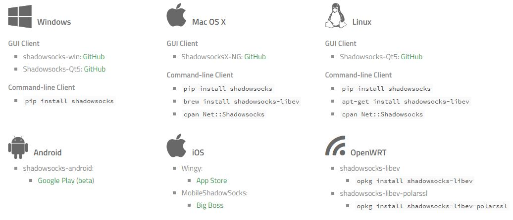
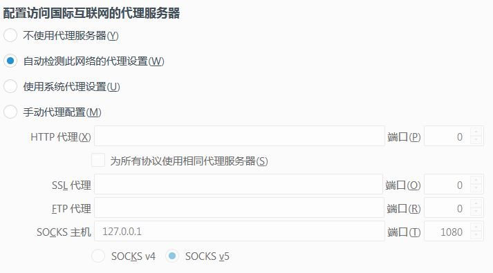
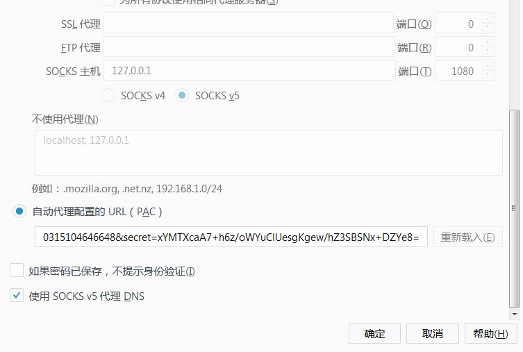
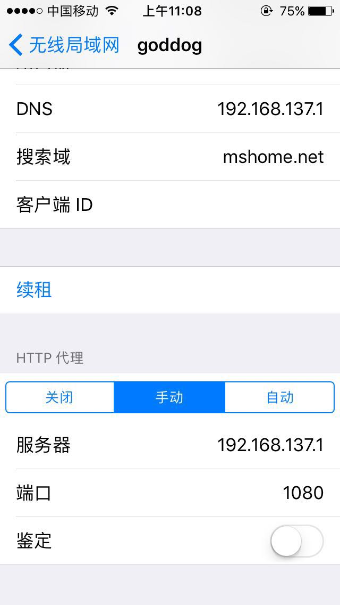

# 客户端

https://shadowsocks.org/en/download/clients.html

Windows / Linux / Mac OS X



Windows 客户端指南：https://github.com/shadowsocks/shadowsocks-windows/wiki/Shadowsocks-Windows-%E4%BD%BF%E7%94%A8%E8%AF%B4%E6%98%8E


Android / iOS

客户端需要指定连接服务端的信息，通过以下格式：

```
ss://BASE64-ENCODED-STRING-WITHOUT-PADDING#TAG
```

Where the plain URI should be:

```
ss://method:password@hostname:port
```

For example, we have a server at `192.168.100.1:8888` using `bf-cfb` encryption method and password `test/!@#:`. Then, with the plain URI `ss://bf-cfb:test/!@#:@192.168.100.1:8888`, we can generate the BASE64 encoded URI:

```
ss://YmYtY2ZiOnRlc3RAMTkyLjE2OC4xMDAuMTo4ODg4Cg
```

To help organize and identify these URIs, you can append a tag after the BASE64 encoded string:

```
    ss://YmYtY2ZiOnRlc3RAMTkyLjE2OC4xMDAuMTo4ODg4Cg#example-server
```

也许觉得上面的方法太麻烦了。还可以将上述信息生成二维码，客户端还支持通过扫描二维码连接服务器


### 全局代理 vs PAC 代理

设置火狐为自动检测网络的代理设置





所谓全局代理的意思是对所有网站的访问都经过代理服务器

PAC 代理

PAC 全称 Proxy auto-config，是浏览器实现自动代理的配置文件，浏览器在访问某个网站时会通过该配置文件来判断是否对本次访问启动代理，这样相较于全局代理，一来避免绕路加快加载速度，二来可以节省代理服务器流量。其实该文件是一个 Javascript 文件，其中包含了许多被墙的网址，如果自己发现某个网站被墙了，也可以自己手动添加网站到该文件中，shadowsocks 会自动检测该文件的变化并及时应用，不过一般建议将自己发现被墙的网站放在用户规则文件中 `user-rule.txt` ，这样在更新 `pac.txt` 时就不会覆盖自定定义的规则了。

从此处获取 PAC list：https://github.com/gfwlist/gfwlist

关于用户定义规则用法详见：https://adblockplus.org/en/filter-cheatsheet

判断当前是否使用代理？
查看开发者工具中的网络，看请求头的远程地址是否为 `0.0.0.0`


### 电脑 ss 共享给手机

win7 wifi https://jingyan.baidu.com/article/48a42057a03cf7a9242504d0.html

shadowsocks 开启“允许来自局域网的连接”

手机连接 win7 wifi，然后点击 wifi 右边的 "i" 进行代理设置，如图：

点击手动，填入电脑的 IP 地址，以及 shadowsocks 在电脑上开启的代理端口




# 服务端

shadowsocks 服务端有各种编程语言实现的版本，如 Python, Perl, C++, Golang 等，本文基于 Golang 

其它的也非常容易参见 https://shadowsocks.org/en/download/servers.html


1. 安装 go

2. 安装 shadowsocks-go

   ```
   go get github.com/shadowsocks/shadowsocks-go/cmd/shadowsocks-server
   ```

3. 配置

   使用 JSON 文件进行配置，样例如下

   ```
   {
       "server":"127.0.0.1",
       "server_port":8388,
       "local_port":1080,
       "local_address":"127.0.0.1",
       "password":"barfoo!",
       "method": "chacha20-ietf-poly1305",
       "timeout":600
   }
   ```

   - `server`: your hostname or server IP (IPv4/IPv6).
   - `server_port`: server port number.
   - `local_port`: local port number.
   - `password`: a password used to encrypt transfer.
   - `timeout`: connections timeout in seconds.
   - `method`: encryption method. 推荐使用 `aes-128-cfb`，方法添加后缀 `-auth`， Append `-auth` to the encryption method to enable [One Time Auth (OTA)](https://shadowsocks.org/en/spec/one-time-auth.html).

4. 后台运行

   ```
   其中 log 用来指定存放 shadowsocks 的日志文件位置，通常设为 /var/log/shadowsocks.log
   shadowsocks-server > log &
   随后可以通过如下命令查看后台进程
   jobs
   ```

   命令行选项

   ```
   shadowsocks-server -p server_port -k password
       -m aes-128-cfb -c config.json
       -t timeout
   ```

5. shadowsocks-go 支持多用户连接服务器的不同端口，配置文件如下

   ```
   {
   	"port_password": {
   		"8387": "foobar",
   		"8388": "barfoo"
   	},
   	"method": "aes-128-cfb",
   	"timeout": 600
   }
   ```

   ​

   要终止该后台进程，需要结合 `jobs` 和 `kill` 命令

* 配置文件建议放在 `/etc/shadowsocks.json`，或者建一个目录 `/etc/shadowsocks/` 下面存放各种 shadowsocks 的配置文件，我创建了两个文件一个用来配置单端口，一个用来配置多端口模式


* Update port password for a running server, Edit the config file used to start the server, then send `SIGHUP` to the server process.


* 结合多端口，动态修改配置文件以及热重启 shadowsocks，使得动态开放 VPN 账户成为可能
* 利用 cron 监控 shadowsocks 进程，参见 https://teddysun.com/525.html
* 结合系统 boot 启动加载机制，使得 shadowsocks 在系统重启时自动加载运行

### UDP relay

Use `-u` command line options when starting server to enable UDP relay.

Currently only tested with Shadowsocks-Android, if you have encountered any problem, please report.


## 优化 shadowsocks server

增加系统能够打开文件描述符的最大数量

To handle thousands of concurrent TCP connections, we should increase the limit of file descriptors opened.

Edit the `limits.conf`

```
vi /etc/security/limits.conf
```

Add these two lines

```
* soft nofile 51200
* hard nofile 51200
```

Then, before you start the shadowsocks server, set the ulimit first 使用 root 用户

```
ulimit -n 51200
```

CentOS 创建 `/etc/sysctl.d/shadowsocks.conf` 添加如下内容

```
fs.file-max = 51200

net.core.rmem_max = 67108864
net.core.wmem_max = 67108864
net.core.netdev_max_backlog = 250000
net.core.somaxconn = 4096

net.ipv4.tcp_syncookies = 1
net.ipv4.tcp_tw_reuse = 1
net.ipv4.tcp_tw_recycle = 0
net.ipv4.tcp_fin_timeout = 30
net.ipv4.tcp_keepalive_time = 1200
net.ipv4.ip_local_port_range = 10000 65000
net.ipv4.tcp_max_syn_backlog = 8192
net.ipv4.tcp_max_tw_buckets = 5000
net.ipv4.tcp_fastopen = 3
net.ipv4.tcp_mem = 25600 51200 102400
net.ipv4.tcp_rmem = 4096 87380 67108864
net.ipv4.tcp_wmem = 4096 65536 67108864
net.ipv4.tcp_mtu_probing = 1
net.ipv4.tcp_congestion_control = hybla
```

运行命令加载配置的内核参数：

```
sysctl -p
```


## 查看暴力破解

shadowsocks 日志位于 `/var/log/shadowsocks.log`

可以利用脚本 https://github.com/shadowsocks/shadowsocks/tree/master/utils 分析日志查看有无被暴力破解的嫌疑，然后利用 Fail2Ban 来屏蔽嫌疑的 IP 地址


## shadowsocks 作者的 Q & A

https://github.com/shadowsocks/shadowsocks/wiki/Troubleshooting

出现问题时，可以按下列步骤确定和诊断问题：

1. 先确定是本地的问题，还是服务端的问题。可以通过更换服务端（比如用别人的或者公共服务器），更换本地端（比如分别用手机和电脑测试）。
2. 查看本地端的日志来诊断本地端有没有收到浏览器的请求。如果本地端没有收到请求，检查浏览器代理设置，检查本地防火墙。如果日志中只有 IP 没有域名，确保你配置浏览器远程解析域名，否则本地需要做防 DNS 污染。
3. 查看服务端的日志来诊断服务端有没有收到本地端发来的请求。如果服务端没有收到请求，检查服务器防火墙，在本地用 tcping 等端口扫描工具检查服务器端口有没有打开。尝试更换 IP 或端口。
4. 如果服务端收到了请求，但浏览器没有载入内容，检查服务端的 DNS `/etc/resolv.conf`，改为 `8.8.8.8` 再重启服务端。
5. 如果服务端速度慢，可能无良 ISP 做了 QoS，更换端口到 `80` `25` `443` `995` `3389` 等常用端口再测试。
6. 如果服务端启动时提示权限问题，可能是系统限制了 <1024 端口权限，用 iptables 做转发即可 `iptables -t nat -A PREROUTING -p tcp --dport 995 -j REDIRECT --to-ports 8387`
7. 如果访问特定的网站有问题，打开浏览器开发者工具网络部分，看一下哪个请求卡住了，然后在服务器上尝试用 ping curl 等工具检查这个请求的 URL 和主机的联通性。并检查这个请求的 URL 是不是被你的 PAC 规则排除了。

更多问题，参见项目 wiki 页面 https://github.com/shadowsocks/shadowsocks/wiki