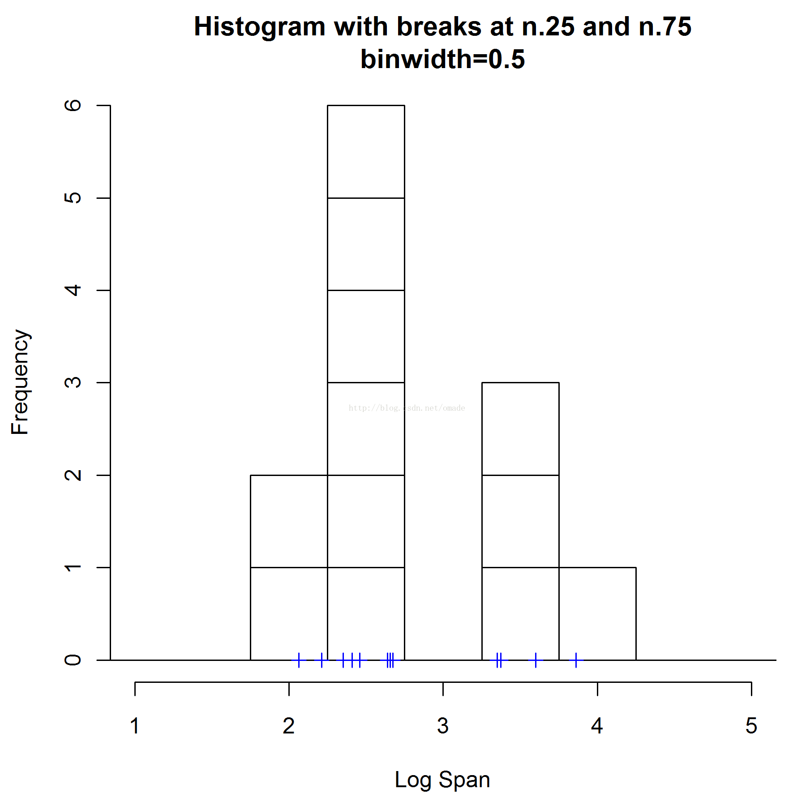
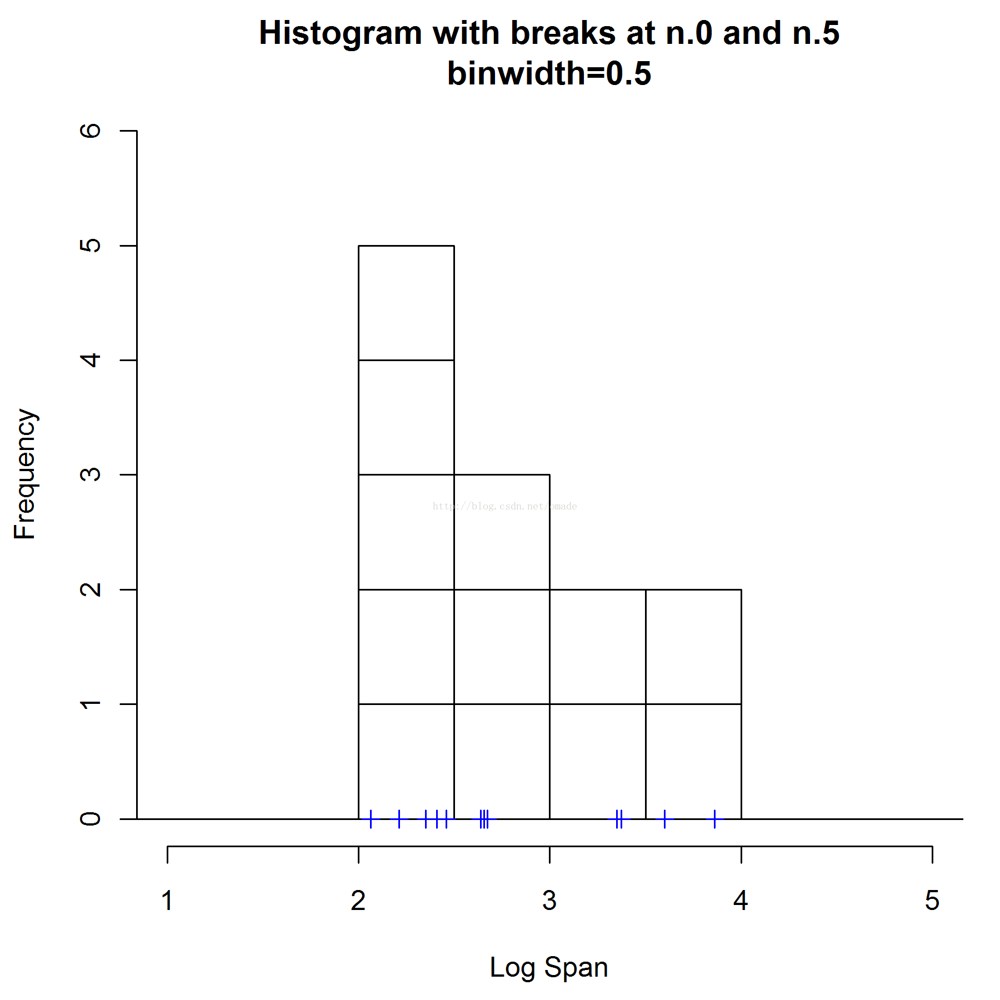
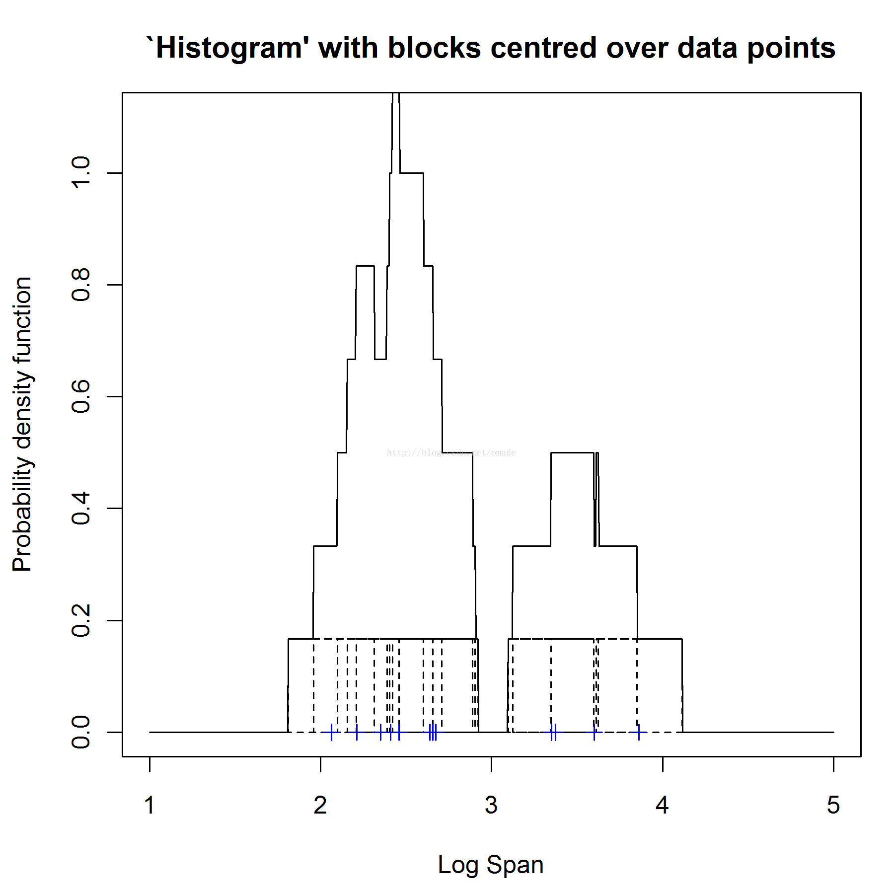
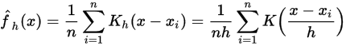
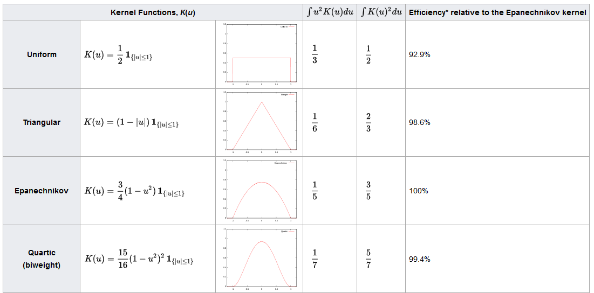
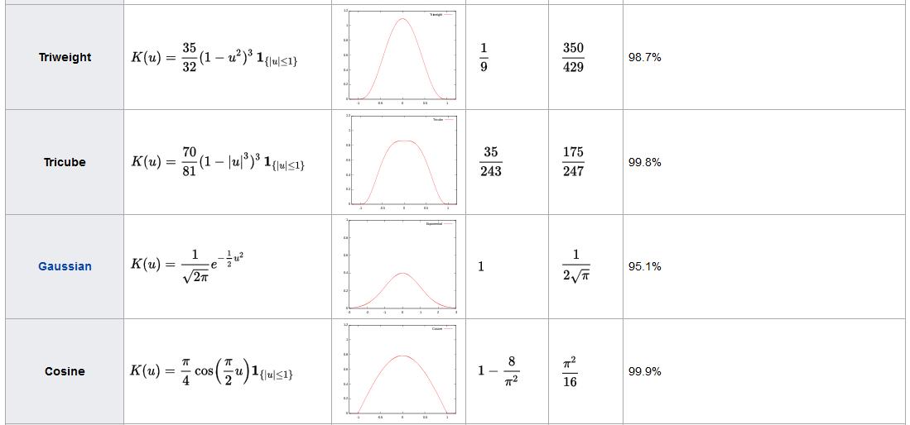
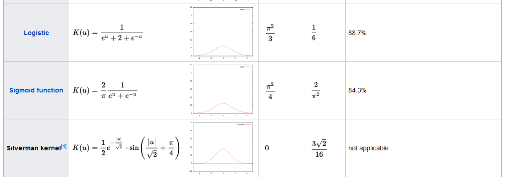
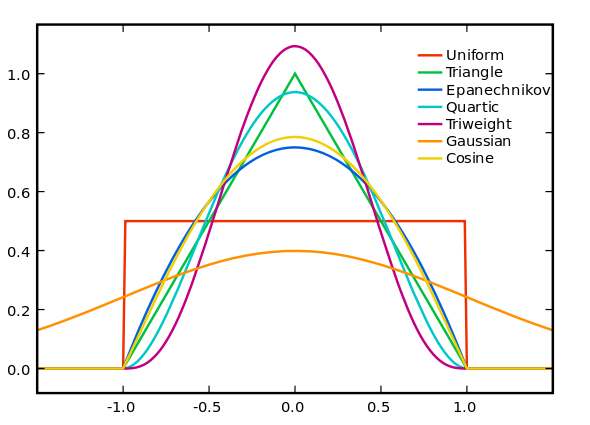
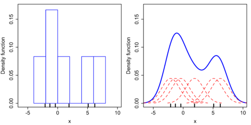
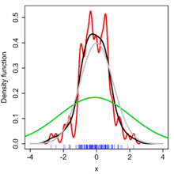

## 建模的一般过程

从样本数据到模型构建，一般会经历一下过程

1. 观测样本数据
2. 验证样本上数据之间的独立性
3. 为样本数据拟合一个概率模型

## 什么是概率密度估计

所谓概率密度函数估计， 即为样本数据寻找符合其分布特点的概率密度函数。

当通过观测样本数据，可以充分了解样本数据符合哪种概率模型时，概率密度函数估计问题简化为估计相应概率模型的参数，即参数估计；当通过观测样本数据并不能确定样本数据的概率模型时，需要为样本数据估计概率模型，即非参数估计。

## 参数估计

***注*：可以进行参数估计的前提是，样本数据的分布符合某个概率模型

最大似然估计（Maximum likelihood estimation）是用来求模型参数的经典方法。而EM算法又是用来求解最大似然估计的。

贝叶斯参数估计，贝叶斯认为模型参数不是固定值，也是符合一定分布的

## 非参数估计

所谓概率就是某个取值发生的频率，因为可以为样本数据指定区间来计算分布在各个区间内的频次，也就可以求出相应区间的概率，这种方法就是直方图。

### 直方图

直方图是简单直观的非参数概率密度估计方法。

直方图的构造也很简单，将样本数据的分布区间划分成等长度的小区间，统计落在各个小区间中的样本数目，分别以分布区间和落在小区间中的样本数目为x，y轴绘制柱状图就是直方图。

直方图反应数据分布状态有两个重要影响因素：区间长度（带宽）以及区间起始位置。区间太小则落在其中的样本不足，区间太大则不足以反应数据分布的特征。区间起始位置则会直接反应到数据分布状态中，下图中（横轴上的蓝色点表示样本数据点）分别使用了不同的区间起始位置，得到的数据分布差异很明显。

为了解决直方图区间开始位置导致数据分布效果不一致，可以采用以样本数据点中心对齐的方式构建小区间，如果这些区间有重叠，则相应的增加计数。这样得到的直方图更加可靠的描述了数据分布状态。这个方法又叫做盒子核密度估计，其得到的密度估计依然是不连续的

### 核密度估计

在基于有限样本数据推断总体中，核密度估计是基础的数据平滑问题。kernel density estimation在统计中是一种重要的非参数概率密度估计方法。

令(x1, x2, …, xn)是从概率密度未知的某种分布中提取的数据，则其相应的kernel density estimator为：

其中的函数K()是核函数，该函数的积分为1，均值为0；其中的h是平滑参数，叫做带宽（bandwidth）,从直观上来看，在样本数据量充分多时，h越小越好；其中带有h下标的函数Kh(x)叫做缩放核（scaled kernel），等于1/h * K(x/h)

常见的核函数有：uniform, triangular, biweight, triweight, Epanechnikov, normal等。Epanechnikov是均方差最优的，normal由于其出色的数学性质，经常被作为核函数使用

### 核密度估计跟直方图

核密度估计跟直方图是密切相关的，不过使用了适当核函数的核密度估计可以避免直方图不平滑的问题。下面以数据集(-2.1, -1.3, -0.4, 1.9, 5.1, 6.2)为例分别绘制直方图和运用了normal核的核密度估计

其中直方图划分了6个区间，每个区间长度为2，每落在区间的一个样本数据点对该区间的贡献为1/12；核密度估计选取了方差为2.25的标准正态函数来作为核函数，其中的红色虚线表示每个数据点对应的核估计，累加起来构成了蓝色的密度函数

### 核密度估计的带宽

带宽选择会严重影响到核密度估计的好坏，下图表示对来自正态分布的随机数据进行核密度估计的结果，其中横轴上标出来待估计的数据样本，灰色曲线表示样本数据真实的概率密度函数，红色曲线表示h=0.05时出现的欠平滑现象，绿色曲线表示h=2时出现的过平滑现象，蓝色曲线表示h=0.337时比较符合真实情况的概率估计

