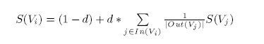
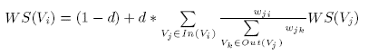

## TextRank

TextRank是一种基于图的文本排序算法

常见基于图的排序算法有：Kleinberg’s HITS algorithm以及Google’s PageRank，这些算法的共同特点是graph-based ranking algorithm is a way of deciding
on the importance of a vertex within a graph, by taking
into account global information recursively computed
from the entire graph, rather than relying only
on local vertex-specific information

但是可以将这些方法应用在自然语言文档构建的词汇图中Applying a similar line of thinking to lexical
or semantic graphs extracted from natural language
documents, results in a graph-based ranking model
that can be applied to a variety of natural language
processing applications, where knowledge drawn
from an entire text is used in making local ranking/
selection decisions. Such text-oriented ranking
methods can be applied to tasks ranging from automated
extraction of keyphrases, to extractive summarization
and word sense disambiguation

unsupervised keyword&sentence extraction

基于图排名算法本质上是利用图的全局信息对顶点重要性进行递归计算，其实就是一个投票思想，顶点到别的顶点的链接被看作对别的顶点的投票，顶点得到投票数越高则其重要性越高，此外重要性越高的顶点在投票时相应权重也越高

给定有向图G=(V,E)，设指向顶点Vi的顶点集为In(Vi)（也即前继顶点集）；设被顶点Vi指向的顶点集为Out(Vi)（也即后继顶点集），则顶点Vi的评分公式如下：

其中d被叫作阻尼因子，pagerank算法的本质是通过投票找出那些重要性较高的页面，而重要性的衡量则根据引用该页面的其它页面打分，但是并不意味着分数越高则该页面就一定很重要，阻尼因子的存在就是模拟打分失效的过程

## TextRank

无向有权图

## Text as a Graph

为了对自然语言文本应用图排序算法，先要想文本转换为图模型。根据应用场景不同，各种粒度的文本单元都可以作为图节点，例如单词，短语，句子等，此外节点间的链接关系也可由各种文本关系来表示，例如词汇的语义，上下文环境重合等关系

应用于自然语言的一般化图排序算法步骤：

1. 从文本中提取文本单元作为图节点
2. 利用文本单元间的关系，为图添加边，可以是有向或无向，也可以是有权或无权的
3. 利用基于图的排序算法迭代至收敛
4. 根据节点的评分进行排序

## 用于关键字提取

The task of a keyword extraction application is to automatically
identify in a text a set of terms that best
describe the document. Such keywords may constitute
useful entries for building an automatic index for
a document collection, can be used to classify a text,
or may serve as a concise summary for a given document.
Moreover, a system for automatic identification
of important terms in a text can be used for the
problem of terminology extraction, and construction
of domain-specific dictionaries

