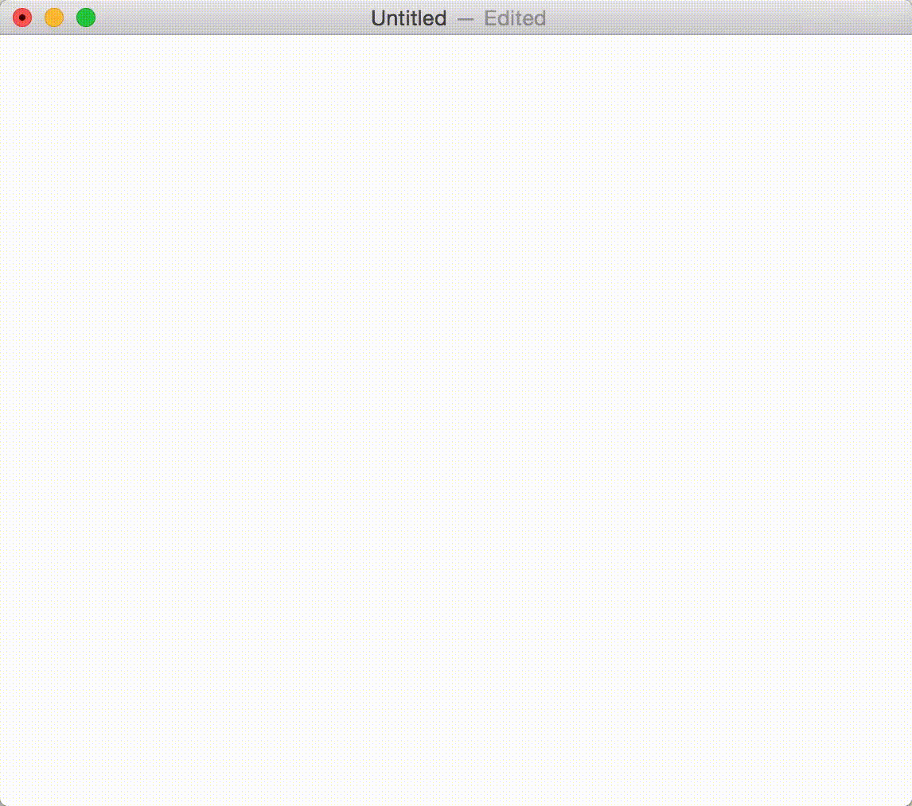
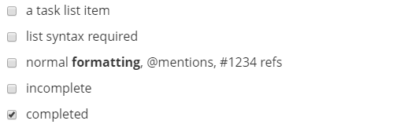
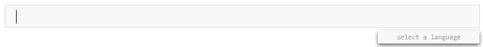
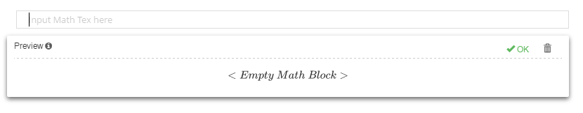
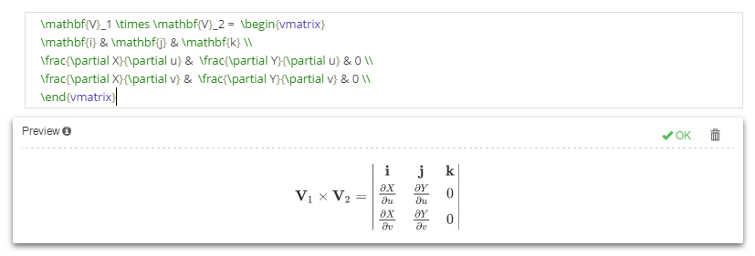
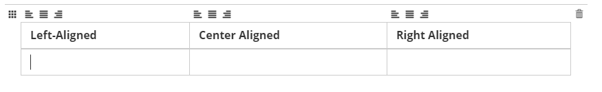
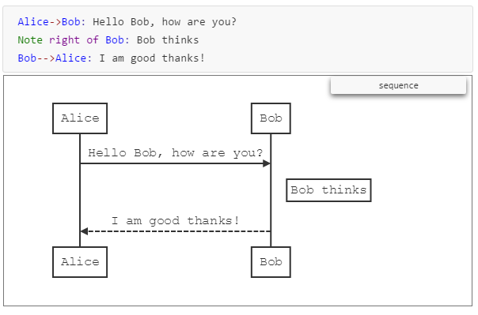
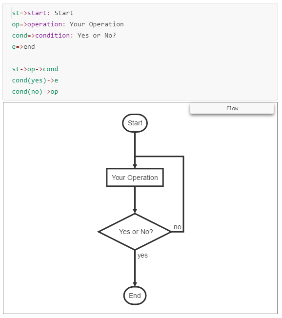

# 概要

用简单的方式创作优美而简洁的文档是每个人的追求，所谓简单是指将作者的精力集中在内容本身的书写，所谓优美是指将书写的内容以美观而简洁的样式呈现出来。

不过在实际中，我们经常遇到的情况是，要么以纯文本文件格式书写出毫无可读性的文档，要么借助Office Word等文字编辑工具来对文档进行细致的排版，前者的缺点是纯文本无法优雅的显示文档，后者的缺点是作者将更多的精力花费在了文档样式排版等这些跟文档内容无关的事情上。

[Markdown](http://daringfireball.net/projects/markdown/syntax)作为轻量级标记语言，允许我们在纯文本文件中添加少量标记元素来增强文档表现力，markdown使得我们可以在纯文本格式下，实现文档层次结构组织、图表插入、列表展示、内容多样化显示，以markdown编辑文档的模式，在简单和优美之间有了很好的权衡，此外由于markdown文档本来就是纯文本内容，使得我们可以在任何电脑上用任何文本文件编辑器打开并编辑它。

以markdown标记语法创作的纯文本文件，虽然可以在任何文本编辑器中打开编辑，但是如何将该文档呈现出markdown所描述的那个样子，即标题、表格、列表、超链接等内容显示为特定的样式，这也就是markdown文档渲染问题。markdown是一种规范化的标记语言，可以将其转换为样式表现能力更强的[HTML](https://en.wikipedia.org/wiki/HTML)等文件格式，然后可以通过软件工具来渲染HTML文档，这就是markdown文档大概的渲染过程。

如果我们以简单的文本编辑器来书写markdown文档的话，我们先要在编辑器中编辑保存文件，然后用某种工具将markdown文档渲染出来，这种方式显著的缺点就是，不能在编辑文档的同时预览文档的渲染效果，为此许多机构开发了markdown文档编辑器，简单来说markdown文档编辑器可以看成文本编辑器+文档渲染器，可以让作者在编辑文档的同时看到文档的渲染效果。

在诸多的markdown文档编辑器中[Typora](https://typora.io/)是一株翘楚，Typora编辑器提供了所见即所得的编辑模式，数学公式的完美插入，表格便捷的编辑等很多提高工作效率的特色，如果你想优雅的创作简单的文档，Typora是不二之选。

*目录*

[TOC]


# Typora

## 简介

Typora是一款强大的markdown编辑器，提供了所见即所得的编辑模式，在编辑文档时只要输入markdown语法，编辑窗口的内容会自动转为最终的输出格式，可以将其看成是以Office Word的方式写markdown文档，不过在Typora中不需要向Office Word那样手动选择复杂的显示样式，只需要输入相应的markdown标记，就可以得到相应的显示样式。除了所见即所得的编辑模式，Typora的许多特色让人惊叹，比如大纲自动生成、表格插入工具、数学公式插入等。

Typora官方的介绍视频：



## 安装

* 从官网[下载](https://typora.io/#download)Typora安装文件并安装
* Typora对多种文件格式（如：docx, odt, rtf, epub, LaTeX等）的导入导出都依赖[Pandoc](http://pandoc.org/)来完成的，为了使用这些文件格式的导入导出功能，需要[安装最新版本](http://pandoc.org/installing.html)的Pandoc。安装好Pandoc后，以后每次导入导出文件时，Pandoc都会在后台默默的工作，不需要再管它了。

# Markdown和Typora

Typora支持兼容[GitHub Flavored Markdown](https://help.github.com/categories/writing-on-github/)语法的markdown

## 块级元素

### 段落

连续的一段文本被当做一个段落，在markdown中通过在文本中输入一个或多个空白行来进行分段，相应的在Typora中通过敲击`Enter`键来分段，通过敲击组合键`Shift` + `Enter`输入空白行。

在markdown中，如果段落文本在结尾处添加两个空格再换行的话，会在该段落下出现一个空白行，相应的在Typora中也可以通过这种方式创建空白行。

### 标题

在markdown中共有1~6级标题，在标题文本前放置相应数量的`#`就可以输入不同级别的标题，同样在Typora中也支持该语法，在输入标题语法，敲击`Enter`键后就可以立即看到标题生成的样式

### 块引用

在markdown中使用以`>`开头的段落来创建块引用，同时在块引用中还可以继续使用该语法来创建层次的块引用，同样在Typora也可以使用块引用语法，引用内容要分段时直接敲击`Enter`，要结束块引用则连续敲击两次`Enter`

### 列表

在markdown中可以使用以`*`、`+`、`-`开头的文本创建无序列表，要创建有序列表则要以`1.`、`2.`等语法作为文本的开头

### 任务列表

任务列表通过为普通列表前添加勾选功能，来标记当前列表项是否已经完成，创建任务列表的扩展markdown语法如下：

```markdown
- [ ] a task list item
- [ ] list syntax required
- [ ] normal **formatting**, @mentions, #1234 refs
- [ ] incomplete
- [x] completed
```

在Typora输入以上内容后，会将其转为：

并且列表项前的勾选框，可以直接在Typora中勾选，相应的markdown代码会自动在`[ ]`和`[x]`间变换。

### 代码块

Typora只支持GitHub Flavoered Markdown语法的代码块，对markdown原生的代码块语法并不支持。

GitHub Flavoered Markdown代码块语法：

```markdown
​```
def test():
	pass
​```

​```python
def test():
	pass
​```
```

相应的在Typora中只需要输入` ``` `，然后再输入`Enter`，就进入了代码块编辑区域:

可以在此处输入代码，然后敲击向右键或者向下键，可以在区域右下角小窗口中输入代码的语言类别（这样就可以高亮代码了），当然也可以在代码块语法起始处添加代码的语言类别，比如：` ```python `

### 数学块

Typora通过使用[MathJax](https://www.mathjax.org/)（一个渲染数学公式的Javascript库），可以直接在Typora书写[LaTeX语法](https://en.wikibooks.org/wiki/LaTeX/Mathematics)的数学表达式并立即可以看到生成的数学表达式。

LaTeX数学表达式语法样例：

```latex
\mathbf{V}_1 \times \mathbf{V}_2 =  \begin{vmatrix} 
\mathbf{i} & \mathbf{j} & \mathbf{k} \\
\frac{\partial X}{\partial u} &  \frac{\partial Y}{\partial u} & 0 \\
\frac{\partial X}{\partial v} &  \frac{\partial Y}{\partial v} & 0 \\
\end{vmatrix}
```

在扩展的markdown语法中，需要以`$$`作为LaTeX数学表达式的起始行和结束行，相应的在Typora中在行首输入`$$`并敲击`Enter`后，就进入了数学公式编辑区域：

编辑区域的上半部分用来输入LaTeX的数学表达式，下半部分用来预览数学表达式，效果是这样的：

敲击向下键则结束公式的编辑，要想重新编辑该公式，只需要用鼠标单击该公式即可。

### 表格

markdown表格语法如下：

```markdown
| Left-Aligned  | Center Aligned  | Right Aligned |
| :------------ |:---------------:| -----:|
| col 3 is      | some wordy text | $1600 |
| col 2 is      | centered        |   $12 |
| zebra stripes | are neat        |    $1 |
```

相应的在Typora中只需要输入markdown表格语法的第一行，比如：`| Left-Aligned  | Center Aligned  | Right Aligned |`，并敲击`Enter`后，就会进入表格编辑模式：

可以看到输入的第一行内容被作为表格的标题，接下来可以在表格编辑模式下填写表格行，并且可以通过各个列顶部的小图标来控制该列的单元格要怎样对齐（居左、居右、居中），同时位于左上角的小图标可用来重新规划表格的行列数目。

### 注脚

所谓注脚就是为内容关联更多的解释的语法，比如在论文中使用上标来标注参考文献，还有在写文章时会为特殊词汇添加注释，并在文章中通过上标的形式引用放在文章末尾的注释。扩展的markdown注脚语法正是为此而生，可以通过如下语法来创建注脚以及引用注脚：

```markdown
这里是正文中的一段内容，我要引用注脚，我喜欢哥特式建筑[^1]

[^1]: 这里是注释内容，可以将注释内容放在文档中任意部位，不过一般来说注释内容都会放在正文后面。哥特式建筑又叫做发饰建筑，很多教堂是哥特式的。

要注意的是同一个注脚的引用可以不止一次，但同一个注脚的定义只能出现一次
```

在Typora中直接使用markdown语法就可以创建注脚，并且将鼠标移到注脚引用位置时，会弹出注脚的内容。

### 水平线

在markdown中水平分割线的语法为`***`或`---`，同样的在Typora中输入`***` + `Enter`或`---` + `Enter`后可以立马生成一条水平分割线

### 文章元信息

Typora支持[YAML Front Matters](http://jekyllrb.com/docs/frontmatter/)语法来描述文章元信息（如：作者、日期等），要注意的是必须将YAML描述放在文档的起始位置。在Typora中，只需要在文档起始处输入`---` + `Enter`，然后进入进入YAML编辑模式，一般来说会在元信息中包含作者、日期、标题等信息。

### 文档目录

因为markdown文档一般会按照1~6级标题对文档内容进行分层，这种分层结构可以类比为书本的章节，Typora提供了便捷的方式可以自动为文档生成基于这种层级结构的目录（table of contents），只需要输入`[toc]` + `Enter`后，Typora会自动在当前位置插入文档的目录，目录以文档中各级标题作为层级结构并且可以点击目录项可以跳转到文档中相应位置，事实上生成目录后并不会在markdown文件中真的插入目录内容，而是仅仅插入一个标记`[TOC]`，该标记用来指代文档的目录内容。

### 图表

Typora支持在markdown文档中插入图表，但遗憾的是在将文档导出为其它格式时，这些图表并不会伴随生成。同时插入图表的扩展语法在标准markdown以及GitHub Markdown中都不支持，所以建议在markdown文档中插入图表时，最好插入截图，不要依赖Typora扩展的图表语法。

* UML序列图

  序列图由[js-sequence](https://bramp.github.io/js-sequence-diagrams/#syntax)实现的，语法样例：

  ```markdown
  ​```sequence
  Alice->Bob: Hello Bob, how are you?
  Note right of Bob: Bob thinks
  Bob-->Alice: I am good thanks!
  ​```
  ```

  效果如下：

* 流程图

  流程图由[flowchart.js](http://flowchart.js.org/)实现，语法样例：

  ```markdown
  ​```flow
  st=>start: Start
  op=>operation: Your Operation
  cond=>condition: Yes or No?
  e=>end

  st->op->cond
  cond(yes)->e
  cond(no)->op
  ​```
  ```

  效果如下：

* mermaid

  [mermaid](https://github.com/knsv/mermaid)的愿景是以类似markdown语法的方式来创建图表，是一个大而全标记语言生成图表工具，同时支持上面的sequence和flowchart语法创建图表，详见[文档](https://knsv.github.io/mermaid/#mermaid)

## 行内元素

### 链接

markdown为链接提供了两种语法：

```markdown
方式一
This is a link to [baidu](http://baidu.com)
This is a link to [baidu](http://baidu.com "放置链接的title")

方式二
This is a link to [baidu][baidu-id]
在文档任意位置定义baidu-id引用的链接内容
[baidu-id]: http://baidu.com "放置链接title"
或者简写方式
[Baidu][]
[Baidu]: http://baidu.com
```

此外Typora提供了直接用URL作链接的方式，语法如下：

```markdown
<www.google.com>
```

### 图片

Typora插入图片的语法更markdown一样：

```markdown


```

但在Typora中我们可以省去编辑插入图片语句，可以通过从本地文件系统或者浏览器直接拖拽图片来插入当前文档中。

### 强调

表示强调语义的markdown语法如下：

```markdown
一般强调
_single asterisks_
*single asterisks*
突出强调
__double asterisks__
**double asterisks**
如果文本中含有不用来表示强调的星号和下划线，则需要用反斜杠进行转义
\*this text is surrounded by literal asterisks\*
```

因为程序代码中经常会使用含有`_`的变量名，为避免混淆，不推荐使用`_`和`__`语法表强调

###　行内代码

表示行内代码的语法如下：

```markdown
How to use `printf()` function?
```

### 删除线

GitHub Flavored Markdown扩展的markdown语法提供了对删除线的支持，语法如下：

```markdown
~~Mistaken text.~~
```

### 下划线

直接通过html元素`<u>`添加下划线，`<u>underline</u>`

### 表情符号

Typora支持在文档中嵌入表情符号（UTF8 emoji char），例如：`:smile_cat:` + `Enter`会在当前位置插入猫脸，因为本质上是插入了一个字符，所以插入的笑脸不能单击后进行编辑，要想修改只能删掉后插入新表情符号。

### HTML元素

不同于大多数markdown编辑器会将文档中的html内容进行渲染后输出，Typora除了对少数种类的html元素进行渲染外，大多数html内容会被原样输出。Typora支持可渲染的html元素如下：

```markdown
下划线
<u>underline</u>
图片

注释
<!-- this is html comment -->
超链接
<a href="">link</a>
```

### Typora扩展markdown语法

这些扩展语法，Typora编辑器中也许默认是没有开启支持的，需要打开程序中的偏好设置，来开启Typora对这些语法的支持。

#### 行内数学表达式

Typora支持在段落中书写数学公式，将LaTeX数学表达式用`$`围起来即可，语法样例：`$\lim_{x \to \infty} \exp(-x) = 0$`，再敲击`Enter`键后公式就会生成了。

支持一遍输入数学公式一遍预览公式，摘自官网的演示样例：

#### 上下标注

Typora支持通过以下语法输入上下标：

```markdown
下标
X~2~
上标
X^2^
```

#### 高亮

Typora支持的文本高亮语法如下：

```markdown
==要高亮的文本== 
```

# 杂项

## Pandoc和Typora

[Pandoc](http://pandoc.org/index.html)是强大的文本文档格式转换工具，可以转换大多数常见的文本文档，包括且不限于以下格式：.docx, .latex, .tex, .ltx, .rst, .rest, .org, .wiki, .dokuwiki, .textile, .opml, .epub等。上文又提到Typora导入导出文件依赖Pandoc完成，那么将某个markdown文档转换为pdf等格式时，到底是直接使用Pandoc转换呢，还是使用Typora进行转换？

* 首先要明白，Typora导出markdown文档时，并不是直接将markdown文档交给Pandoc转换格式的，Typora会先将markdown文档生成为一种Pandoc内部使用的文件格式，再交由Pandoc处理的。
* 再来看Pandoc将markdown文档转换为某种格式时的工作流程，首先Pandoc会根据用户指定的markdown解析器对文档解析后再生成目标文件格式。
* 鉴于Typora导出过程以及Pandoc转换文件格式过程，可以得到以下结论：
  * 在Typora中编辑的markdown文档，最好直接通过Typora进行导出，这样可以保证Typora扩展的markdown语法被解析以及保证生成文件样式跟在Typora看到的一样
  * 另外Pandoc也有自己的markdown扩展语法，根据Pandoc扩展语法编写的markdown文档通过Typora导出会使得这些扩展语法得不到解析
  * 总之，针对Typora编写的markdown文档最好通过Typora导出，针对Pandoc编写的markdown文档最好通过Pandoc导出

## 样式主题

Typora内置了几种样式主题可供用户选择，主题样式由CSS文件实现，每种主题都是由相应的CSS文件来控制样式的，也就是说可以通过修改CSS文件来修改主题样式。

* 网上主题资源可供[下载](http://theme.typora.io/)
* 添加自定义主题，从用户偏好设置中打开主题目录，然后将CSS文件以及相关的字体、图像等资源复制到主题目录下，重启Typora后可以选择刚刚新添加的主题
* 在主题根目录下的`base.user.css`文件将重写所有主题的样式，特定主题目录下的`{theme-css-name}.user.css`会重写该主题的样式